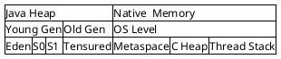

--- 
layout: single
classes: wide
title: "[Java 개념] JVM Garbage Collection"
header:
  overlay_image: /img/java-bg.jpg
excerpt: ''
author: "window_for_sun"
header-style: text
categories :
  - Java
tags:
    - Concept
    - Java
    - JVM
    - Garbage Collection
toc: true
use_math: true
---  

## Garbage Collection 이란
- `GC` 라고 축약해서 부르기도 한다.
- `GC` 는 이미 할당된 메모리에서 더 이상 사용되지 않는 메모리를 해제하는 동작을 의미한다.
- 여기서 사용되지 않는 메모리는 `Stack Area` 에서 참조하지 않는 메모리 영역을 의미한다.
- Java 에서 메모리를 해제하기 위해서는 변수에 `null` 을 설정하거나, `System.gc()` 를 호출 할 수도 있다.
	- `System.gc()` 메소드를 호출하는 것은 매우 주의해야 하는데, 이는 구동 중인 시스템에 성능적으로 큰 영향을 끼칠 수 있기 때문이다.
- `GC` 작업은 `stop-the-world` 라는 동작을 수행하게 되는데, 이는 `GC` 를 실행하기 위해 `JVM` 이 `GC` 를 담당하는 쓰레드외 모든 쓰레드의 작업을 멈추는 것을 의미한다.
	- `GC` 작업 이후에 중지됐던 쓰레드는 다시 실행된다.
- 애플리케이션이 구동된다는 것은 호스트 머신에서 필요한 자원을 할당받아 사용한다는 의미이고, Java 는 다른 언어(C, C++) 과 달리 메모리 관리를 개발자가 직접하지 않고 `GC` 가 이를 담당해 주기 때문에 이러한 작업이 필요하다.
- `GC` 튜닝이란 피할 수 없는 `stop-the-world` 시간을 줄이는 것을 의미한다.
- `GC` 는 아래 2가지 전제조건을 통해 만들어 졌다.
	- 대부분의 객체는 금방 접근 불가능 상태(unreachable)가 된다.
	- 오래된 객체에서 젊은 객체로의 참조는 아주 적게 존재한다.
- 본 포스트에서는 Java 8 을 기준으로 `GC` 를 설명한다.

## Garbage Collection 의 구조
Hotspot JVM 의 Heap Memory 는 아래와 같이 크게 `Young Generation`, `Old Generation`, `Permanent Generation` 으로 구성된다.  

### Young Generation
- `Young Generation` 은 `Eden`, `Survivor0`, `Survivor1` 영역으로 나뉜다.
- 새롭게 생성된 객체가 위치하는 곳이다.
- 대부분의 객체가 금방 접근 불가능 상태가 되기 때문에 대부분의 객체는 `Young Generation` 영역에 생성되었다가 사라진다.
- `Young Generation` 영역에서 발생하는 `GC` 를 `Minor  GC` 라고 한다.

### Old Generation
- `Minor GC` 이후에도 생존한 객체는 `Old Generation` 으로 이동된다. 
- `Young Genration` 보다 큰 크기를 가지고 있고, `GC` 도 적게 발생한다.
- `Old Generation` 에서 발생하는 `GC` 를 `Major GC` 혹은 `Full GC` 라고 한다.

### Native Memory
- Java 8 이전 에는(Java 7까지) `Permanent Generation` 이라는 공간이 있고, 이또한 `GC` 영역이였지만 아래 이슈들로 인해 사라지게 되었다.
	- `Static Object` 의 사용에 따른 메모리 사용 증가
	- `Class`, `Method Meta Data` 의 증가
- Java 8 이전과 이후의 변화를 아래 표를 통해 정리한다.

. | Java 7 | Java 8
---|---|---
Class Meta Data | Permanent | Metaspace
Method Meta Data | Permanent | Metaspace
Static Object | Permanent | Heap
Constant Object(String) | Permanent | Heap

- `Natvie Memory` 공간은 OS 레벨에서 관리하는 영역이므로 `Metaspace` 영역의 크기에 대해 개발자가 크게 의식할 필요가 없어졌다.

## Garbage Collection 의 동작

```plantuml
@startsalt

{#

Java Heap | * | * | * 
Young Gen | *  | *  | Old Gen
Eden | S0 | S1 | Tensured 
Minor GC | * | * | Major GC

}
@endsalt
```  

### Young Generation
- 처음 객체가 생성되면 `Eden` 영역에 생성되고 `Eden` 영역이 가득 차게 되면, `Minor GC` 가 발생한다.
		
	
	
- `Minor GC` 에서 살아남은 객체는 `Survivor` 영역중 한곳으로 이동하면서, `Survivor` 영역에는 `Eden` 에서 살아남은 객체가 쌓인다.

	

- `Minor GC` 과정을 반복할 때마다 살아남은 객체는 `Age` 값이 증가하게 된다.

	
	
- `Survivor` 영역이 가득 차게되면 그중 살아남은 객체를 다른 `Survivor` 영역으로 이동하고, 가득 찬 `Survivor` 영역은 빈 상태가 된다.
	- `Minor GC` 가 발생 할때 마다, `S0`, `S1` 영역을 번갈아 가면서 사용한다.
	- JVM 옵션을 통해 `Eden` 영역과 `Survivor` 영역의 비율을 조정할 수 있다. (`-XX:SurvivorRate=n`)

	
	
- 이러한 과정을 반복하다 계속해서 살아 남은 객체는 `Old Generation` 영역으로 이동하게 된다.
- 빠른 메모리 할당을 위해 `bump-the-pointer` 와 `TLAB`(Thread-Local Allocation Buffers) 라느 기술을 사용한다.
	- `bump-the-pinter` : `Eden` 영역에 할당된 마지막 객체를 추적한다. 
	마지막 객체는 영역 맨 위에 존재한다. 
	그리고 다음 생성되는 객체는 크기가 `Eden` 영역에 넣을 수 있는지 검사한다. 
	정당한 크기라면 영역에 추가하고 추가된 객체가 맨위에 위치하게 된다. 
	새로운 객체를 생성할 때 마지막에 추가된 객체만 검사하기 때문에 매우 빠르게 동작이 가능하다. 
	- `TLAB` : 멀티 스레드 환경에서 `Thread-Safe` 를 보장하기 위해 각 쓰레드는 `Eden` 영역의 작은 부분을 가지게 된다. 
	각 쓰레드에는 자신의 `TLAB` 영역에만 접근 할 수 있기 때문에, `bump-the-pointer` 기술을 사용할 때 `Lock` 을 수행하지 않고 메모리 할당이 가능하다.

### Old Generation
- `Minor GC` 가 반복되고, 살아남은 객체들의 `Age` 가 증가해서 임계값을 넘어서면 `Old Generation` 영역으로 이동된다.
	- `Age` 의 임계값은 JVM 옵션에서 설정가능하다. (`-XX:MaxTenuringThreashold=n`)
	
	
	
	
	
- 계속해서 `Old Generation` 영역에 쌓인 객체가 가득 차게되면 `Major GC` 가 발생해서 영역을 정리하게 된다.
	- major gc 종류 및 설명 차이 등등
	

---
## Reference
[Java Garbage Collection](https://d2.naver.com/helloworld/1329)  
[JDK 8 Garbage Collection Tuning Guide](https://docs.oracle.com/javase/8/docs/technotes/guides/vm/gctuning/)  
[What is Java Garbage Collection? How It Works, Best Practices, Tutorials, and More](https://stackify.com/what-is-java-garbage-collection/)  
[Java Garbage Collection Basics](https://www.oracle.com/webfolder/technetwork/tutorials/obe/java/gc01/index.html)  
[Java - Garbage Collection(GC,가비지 컬렉션) 란?](https://coding-start.tistory.com/206)  