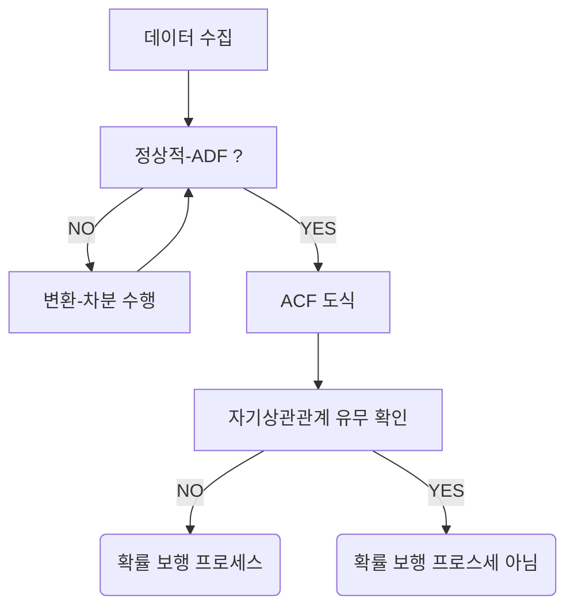

--- 
layout: single
classes: wide
title: "[TimeSeries] Random Walk"
header:
  overlay_image: /img/data-science-bg.jpg
excerpt: '시계열에서 Random Walk(확률 보행)의 개념과 시뮬레이션, 정상성 검정, 예측 방법을 알아보자'
author: "window_for_sun"
header-style: text
categories :
  - Data Science
tags:
    - Practice
    - Data Science
    - Time Series
    - Random Walk
    - Stationary Time Series
    - ADF Test
    - ACF
toc: true
use_math: true
---  


## Random Walk
`Random Walk`(확률 보행)은 다음 값이 이전 값에 무작위로 더해지거나 빼지는, 
즉 상승이나 하락의 확률이 동일한 시계열 프로세스이다. 
금융 데이터처럼 실제 데이터에서도 자주 나타는 형태이다. 
이런 확률 보행의 특징은 때로는 한 방향의 추세가 길게 지속되기도 하고, 갑작스러운 변화가 일어나기도 한다. 

### Simulate Random Walk
확률 보행이 어떤 형태인지 이해하기 위해 젝접 시뮬레이션을 진행한다. 
확률 보행을 식으로 나타낸다면 `백색소음` 이라는 난수가 포함된다. 
어떻게 보면 확률 보행은 시간에 따라 변화하는 난수의 누적합이라고 할 수 있는데, 
이를 파이썬 코드로 구현하면 다음과 같다. 

방식은 간단한다. 
평균이 0이고 분산이 1인 정규분포에서 난수를 1000개 생성한다. 
그리고 이 난수의 누적합을 구하면 확률 보행이 된다. 

```python
import numpy as np

from CH03.CH03 import GOOGL_diff_ADF_result

np.random.seed(42)

steps = np.random.standard_normal(1000)
steps[0] = 0

random_walk = np.cumsum(steps)

random_walk
# array([  0.        ,  -0.1382643 ,   0.50942424,   2.03245409,
#          1.79830072,   1.56416376,   3.14337658,   3.91081131,
#          3.44133692,   3.98389696,   3.52047927,   3.05474952,
#          3.29671179,   1.38343154,  -0.34148629,  -0.90377382,
#          -1.91660494,  -1.6023576 ,  -2.51038168,  -3.92268538,
#          -2.45703661,  -2.68281291,  -2.61528471,  -4.04003289,
#          -4.58441562,  -4.47349303,  -5.62448661,  -5.24878859,
#          -5.84942728,  -6.14112103,  -6.74282764,  -4.89054946,
#          -4.90404668,  -5.96175761,  -5.1392127 ,  -6.36005635,
#          -6.15119275,  -8.11086288,  -9.43904893,  -9.24218769,
#          -8.50372111,  -8.33235283,  -8.44800111,  -8.74910481,
#          -10.2276268 , -10.94747101, -11.40810978, -10.35098755,
# ])
```  

그리고 이를 어떠한 추세 변화로 이뤄지는지 보기위해 도식화하면 아래와 같다.  

```python
from matplotlib import pyplot as plt

fig, ax = plt.subplots()

ax.plot(random_walk)
ax.set_xlabel('Timesteps')
ax.set_ylabel('Value')
```  


`확률 보행` 을 시게열 관점에서 정의하면 첫 번째 차분이 정상적이고 상관관계가 없는 시계열이다. 
즉 절차가 완전히 무작위로 변화하는 시계열로 정의할 수 있다.  

시계열이 확률 보행인지 확인하는 절차는 아래와 같다. 




가장 먼저 정상성을 검증한다.(`ADF`) 
비정상적인 경우 정상이 될 때까지 변환을 적용해야 한다. 
그리고 자기상관함수(`ACF`)로 도식화해 자기상관관계가 있는지 확인하고, 
있다면 확률 보행 프로세스가 아니고, 없다면 확률 보행 프로세스라고 볼 수 있다.  


### Stationary Time Series
`정상적 시계열`(Stationary Time Series) 은 시간이 지나도 통계적 특성이 변하지 않는 계열을 의미한다. 
좀 더 자세히 설명하면 통계적 특성인 평균(`Average`), 분산(`Variance`), 공분산(`Covariance`) 등과 같은 값들이 시간이 지나도 일정하게 유지되는 것을 의미한다. 
간단하게 예를 들면 시간에 따라 계속 주사위를 던져 시계열을 그려보면 데이터의 범위는 `1 ~ 6` 사이에서 계속 왔다갔다 하고, 특정 시간 범위의 평균도 `3.5` 근처에서 유지된다.  

이후에 살펴보는 통계적 시계열 모델인 이동평균(`MA`), 자기회귀(`AR`), 자기회귀이동평균(`ARMA`), 자기회귀누적이동평균(`ARIMA`) 모델 등은 모두 정상적 시계열을 전제로 한다는 것은 기억해야 한다.  

만약 시계열이 정상적이 아닌 경우 수행해야 하는 것은 `Transform`(변환)이다. 
가장 쉽게 적용해 볼 수 있는 변환은 차분으로, 어떤 시간의 값과 그다음 시간의 값의 차이를 구하는 것이다. 
이렇게하면 평균을 안정화하고 추세와 계절적 효과를 제거하거나 줄일 수 있다. 
또한 변환은 필요한 경우 1차 차분, 2차 차분 등 여러 번 적용할 수 있다. 
그리고 차분을 통해 모델이 예측한 결과는 차분된 값이기 때문에 이를 기존 규모로 복원하는 `Inverse Transform`(역변환)도 필요하다.  

### ADF Test
`ADF`(Augmented Dickey-Fuller) 검정은 시계열이 정상적인지 여부를 판단하는 통계적 검정 방법이다. 
`ADF` 검정은 귀무가설(`Null Hypothesis`)과 대립가설(`Alternative Hypothesis`)로 구성된다. 
귀무가설은 시계열이 비정상적이라는 것이고, 대립가설은 시계열이 정상적이라는 것이다. 
검정 결과로 얻은 `ADF` 통계값이 큰 음수 이면서 `p-value` 가 일반적으로 `0.05` 보다 작으면 귀무가설을 기각하고, 시계열이 정상적이라고 판단한다. 
반대로 `ADF` 통계값이 큰 음수가 아니고 `p-value` 가 `0.05` 보다 크면 귀무가설을 채택하고, 시계열이 비정상적이라고 판단한다.

> 여기서 `귀무가설`이란 검정하고자 하는 가설이 참이라는 전제하에 출발하는 가설이다.
> 쉽게 설명하면 어떤 실험이나 검정을 할 때 `차이가 없다`, `효과가 없다`, `변화가 없다` 는 식으로 기존 상태가 그대로 유지 된다는 가정을 귀무가설이라고 한다. 
> `대립가설`은 반대로 `차이가 있다`, `효과가 있다`, `변화가 있다` 는 식으로 기존 상태와 다른 새로운 상태가 존재한다는 가정이다. 


시뮬레이션한 확률 보행이 정상적인지 `ADF` 검정을 수행해 본다. 
`ADF` 검정을 수행하려면 `statsmodels` 패키지의 `adfuller` 함수를 사용한다. 


```python
from statsmodels.tsa.stattools import adfuller
ADF_result = adfuller(random_walk)

print(f'ADF Statistic: {ADF_result[0]}')
# ADF Statistic: -0.9659524876918755
print(f'p-value: {ADF_result[1]}')
# p-value: 0.7654789696692579
```  

결과적으로 시뮬레이션한 확률 보행은 `ADF` 통계값이 큰 음수가 아니고 `p-value` 가 `0.05` 보다 크므로 귀무가설을 채택하고, 시계열이 비정상적이라고 판단한다. 
즉 시간에 따라 평균과 분산이 변하는 시계열이라고 할 수 있다.  


### ACF
`ACF`(Autocorrelation Function)는 시계열 데이터의 자기상관관계를 측정하는 통계적 도구이다. 
자기상관관계는 시계열 데이터의 현재 값이 과거 값과 얼마나 관련이 있는지를 나타낸다. 
`ACF` 는 시계열 데이터의 각 시점에서 일정한 시간 간격(시차, `lag`)을 두고 자기상관계수를 계산하여 시계열의 패턴과 구조를 이해하는 데 도움을 준다. 
`ACF` 는 시계열 데이터의 추세, 계절성, 주기성 등을 파악하는 데 유용하며, 시계열 모델링 및 예측에 중요한 역할을 한다. 
`ACF` 는 일반적으로 시계열 분석에서 `시차`(lag)와 `자기상관계수`(autocorrelation coefficient)를 시각적으로 표현한 그래프로 나타낸다. 
그래프에서 `x축`은 시차를 나타내고, `y축`은 해당 시차에서의 자기상관계수를 나타낸다. 
그래프에서 자기상관계수가 `0`에 가까운 경우, 해당 시차에서는 시계열 데이터 간에 상관관계가 거의 없음을 의미한다. 
반대로 자기상관계수가 `1`에 가까운 경우, 해당 시차에서는 시계열 데이터 간에 강한 양의 상관관계가 있음을 의미한다. 
자기상관계수가 `-1`에 가까운 경우, 해당 시차에서는 시계열 데이터 간에 강한 음의 상관관계가 있음을 의미한다.  

이번에도 시뮬레이션한 확률 보행의 `ACF` 를 도식화해 본다.
`ACF` 를 도식화하려면 `statsmodels` 패키지의 `plot_acf` 함수를 사용한다. 
`ACF` 도식을 위해서는 `lags`(시차/지연) 값을 지정해 그래프의 `x축` 범위를 설정할 수 있다. 
20개의 지연에 대해서 그려본다.  


```python
from statsmodels.graphics.tsaplots import plot_acf

plot_acf(random_walk, lags=20);

plt.tight_layout()
```  


`ACF` 도식을 보면 지연이 증가함에 따라 자기상관계수가 점차적으로 감소하는 것을 볼 수 있다. 
하지만 지연 20인 시점에서도 자기상관계수가 있으므로 자기상관관계가 있어, 비정상적임을 의미한다. 
추가로 그래프를 보면 음영 영역이 있는데 이는 신뢰 구간(`Confidence Interval`)을 나타낸다. 
즉 자기상관계수가 이 영역 밖에 있으면 통계적으로 유의미한 자기상관관계가 있다고 판단할 수 있고, 
이 영역 안에 있으면 통계적으로 유의미한 자기상관관계가 없다고 판단할 수 있다. 


### Transform
앞서 시뮬레이션한 확률 보행 시계열은 `ADF` 검정에서 바정상적임을 확인했다. 
그로므로 정상적이 되도록 변환을 적용해 본다. 
변환은 앞서 설명한 것과 같이 차분(`diff)` 를 적용한다.  

차분은 `numpy` 라이브러리의 `diff` 메서드를 사용해 간단하게 적용할 수 있다. 
이때 `n` 파라미터로 몇 차 차분을 적용할지 지정할 수 있다.  

```python
diff_random_walk = np.diff(random_walk, n=1)
```  

차분한 값을 도식화하면 아래와 같이 비교적 추세는 사라지고 안정적인 형태로 평균이 `0` 근처에서 왔다갔다 하는 것을 볼 수 있다.  

```python
plt.plot(diff_random_walk)
plt.title('Differenced Random Walk')
plt.xlabel('Timesteps')
plt.ylabel('Value')
plt.tight_layout()
```  


이제 다시 정상성 테스트(`ADF` 검정)를 수행해 본다.  

```python
ADF_result = adfuller(diff_random_walk)

print(f'ADF Statistic: {ADF_result[0]}')
# ADF Statistic: -31.789310857560594
print(f'p-value: {ADF_result[1]}')
# p-value: 0.0
```  

결과적으로 `ADF` 통계값이 큰 음수 이면서 `p-value` 가 `0.05` 보다 작으므로 귀무가설을 기각하고, 시계열이 정상적이라고 판단할 수 있다. 

이제 변환된 정상적 시계열로 다시 `ACF` 도식을 그려본다.  

```python
plot_acf(diff_random_walk, lags=20);

plt.tight_layout()
```  


`ACF` 도식을 보면 지연 0이후에는 유의한 자기상관계수가 없음을 볼 수 있다. 
이로 정상적 프로세스가 완전히 무작위라는 의미로, 이는 `백색소음`을 의미한다. 
즉 각 값은 이전 값과 무작위로 차이를 보이는 다는 것으로 값들 간의 아무런 관계가 없다는 것을 시사한다.  

결론적으로 최초에 시뮬레이션한 확률 보행 시계열은 비정상적이었지만,
차분을 적용해 정상적 시계열로 변환할 수 있었고,
정상적 시계열은 완전히 무작위적인 프로세스라는 것을 확인하며 확률 보행임의 정의와 일치함을 확인할 수 있었다.  


### Stock Price as Random Walk
이번에는 실제 금융 데이터를 바탕으로 확률 보행인지 확인해 본다. 
예제로는 구글(`GOOGL`)의 주가 데이터를 사용한다. 
데이터는 `yfinance` 패키지를 사용해 `2020-04-27` ~ `2021-04-27` 까지 종가를 사용한다.  

```python

import yfinance as yf
import pandas as pd
import numpy as np

df = yf.download('GOOGL', start='2020-04-27', end='2021-04-27')

fig, ax = plt.subplots()

ax.plot(df['Date'], df['Close'])
ax.set_xlabel('Date')
ax.set_ylabel('Closing price (USD)')

plt.xticks(
    [4, 24, 46, 68, 89, 110, 132, 152, 174, 193, 212, 235],
    ['May', 'June', 'July', 'Aug', 'Sep', 'Oct', 'Nov', 'Dec', 'Jan 2021', 'Feb', 'Mar', 'April'])

fig.autofmt_xdate()
plt.tight_layout()
```  


`GOOGL` 주가 데이터는 전반적으로 상승하는 추세를 보인다.
이제 `ADF` 검정을 수행해 본다.  

```python
GOOGL_ADF_result = adfuller(df['Close'])

print(f'ADF Statistic: {GOOGL_ADF_result[0]}')
# ADF Statistic: 0.16025048664771271
print(f'p-value: {GOOGL_ADF_result[1]}')
# p-value: 0.9699419435913057
```  

결과적으로 `ADF` 통계값이 큰 음수가 아니고 `p-value` 가 `0.05` 보다 크므로 귀무가설을 채택하고, 시계열이 비정상적이라는 것을 확인할 수 있다. 
그러므로 변환(차분)을 수행한뒤 다시 `ADF` 검정을 수행해 본다.  

```python
diff_close = np.diff(df['Close'], n=1)

GOOGL_diff_ADF_result = adfuller(diff_close)

print(f'ADF Statistic: {GOOGL_diff_ADF_result[0]}')
# ADF Statistic: -5.303439704295232
print(f'p-value: {GOOGL_diff_ADF_result[1]}')
# p-value: 5.3865309614546085e-06
```  

결과적으로 `ADF` 통계값이 큰 음수 이면서 `p-value` 가 `0.05` 보다 작으므로 귀무가설을 기각하고, 시계열이 정상적이라고 판단할 수 있다. 
이제 `ACF` 함수를 도식화해 자기상관관계가 있는지 확인한다.  

```python
plot_acf(diff_close, lags=20);
```  


`ACF` 도식을 보면 지연 0이후에는 큰 자기상관관계는 볼 수 없지만, 
지연 5와 18이 신뢰 구간 밖으로 조금 벗어난 것을 볼 수 있다. 
지속적으로 발생하는 현상이 아니기 때문에 이는 우연에 따른 것으로 볼 수 있다. 
그러므로 차분한 시계열은 자기상관관계가 없다고 볼 수 있다.  


### Forecasting Random Walk
앞서 확률 보행은 무작위로 진행되는 시게열 값이라는 것을 확인했다. 
이러한 확률 보행 특성을 가진 시계열의 미래 값을 예측하는 것은 매우 어렵다. 

무작위로 변화하는 값을 예측하는 것은 본질적으로는 불가능하다. 
이는 이상적이지 않기 때문에 사용할 수 있는 방법은 `Baseline Model` 밖에 없다. 
값에 무작위성이 있기 때문에 이후에 다룰 통계적 모델(`ARIMA`, `SARIMA` 등)도 적용할 수 없다. 
즉 과거의 값 혹은 평균값, 마지막 값을 미래의 값으로 사용하는 방법 밖에 없다.  
