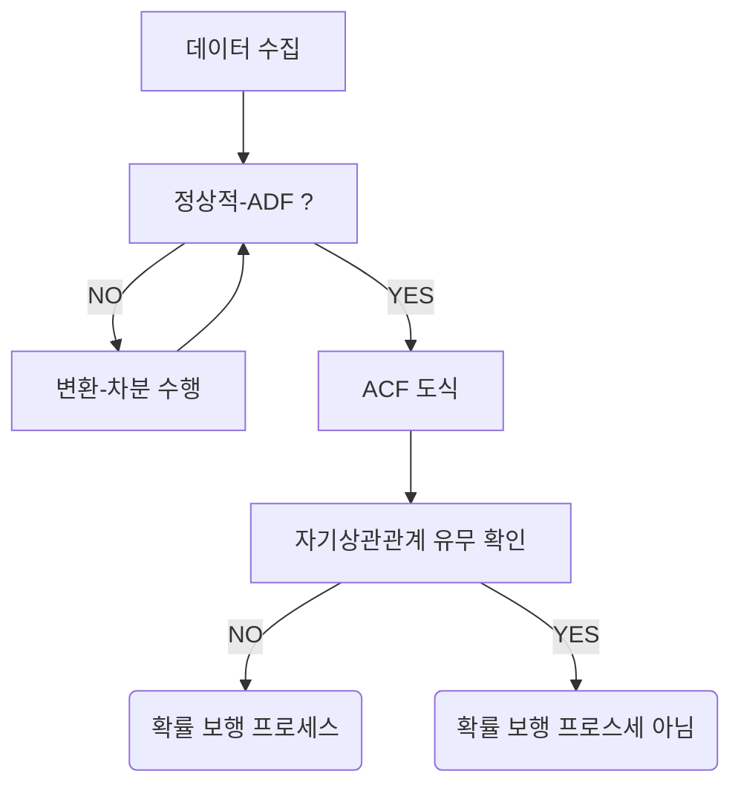

--- 
layout: single
classes: wide
title: "[TimeSeries] Random Walk"
header:
  overlay_image: /img/data-science-bg.jpg
excerpt: '시계열에서 Random Walk(확률 보행)의 개념과 시뮬레이션, 정상성 검정, 예측 방법을 알아보자'
author: "window_for_sun"
header-style: text
categories :
  - Data Science
tags:
    - Practice
    - Data Science
    - Time Series
    - Random Walk
    - Stationary Time Series
    - ADF Test
    - ACF
toc: true
use_math: true
---  


## Random Walk
`Random Walk`(확률 보행)은 다음 값이 이전 값에 무작위로 더해지거나 빼지는, 
즉 상승이나 하락의 확률이 동일한 시계열 프로세스이다. 
금융 데이터처럼 실제 데이터에서도 자주 나타는 형태이다. 
이런 확률 보행의 특징은 때로는 한 방향의 추세가 길게 지속되기도 하고, 갑작스러운 변화가 일어나기도 한다. 

### Simulate Random Walk
확률 보행이 어떤 형태인지 이해하기 위해 젝접 시뮬레이션을 진행한다. 
확률 보행을 식으로 나타낸다면 `백색소음` 이라는 난수가 포함된다. 
어떻게 보면 확률 보행은 시간에 따라 변화하는 난수의 누적합이라고 할 수 있는데, 
이를 파이썬 코드로 구현하면 다음과 같다. 

방식은 간단한다. 
평균이 0이고 분산이 1인 정규분포에서 난수를 1000개 생성한다. 
그리고 이 난수의 누적합을 구하면 확률 보행이 된다. 

```python
import numpy as np

from CH03.CH03 import GOOGL_diff_ADF_result

np.random.seed(42)

steps = np.random.standard_normal(1000)
steps[0] = 0

random_walk = np.cumsum(steps)

random_walk
# array([  0.        ,  -0.1382643 ,   0.50942424,   2.03245409,
#          1.79830072,   1.56416376,   3.14337658,   3.91081131,
#          3.44133692,   3.98389696,   3.52047927,   3.05474952,
#          3.29671179,   1.38343154,  -0.34148629,  -0.90377382,
#          -1.91660494,  -1.6023576 ,  -2.51038168,  -3.92268538,
#          -2.45703661,  -2.68281291,  -2.61528471,  -4.04003289,
#          -4.58441562,  -4.47349303,  -5.62448661,  -5.24878859,
#          -5.84942728,  -6.14112103,  -6.74282764,  -4.89054946,
#          -4.90404668,  -5.96175761,  -5.1392127 ,  -6.36005635,
#          -6.15119275,  -8.11086288,  -9.43904893,  -9.24218769,
#          -8.50372111,  -8.33235283,  -8.44800111,  -8.74910481,
#          -10.2276268 , -10.94747101, -11.40810978, -10.35098755,
# ])
```  

그리고 이를 어떠한 추세 변화로 이뤄지는지 보기위해 도식화하면 아래와 같다.  

```python
from matplotlib import pyplot as plt

fig, ax = plt.subplots()

ax.plot(random_walk)
ax.set_xlabel('Timesteps')
ax.set_ylabel('Value')
```  


`확률 보행` 을 시게열 관점에서 정의하면 첫 번째 차분이 정상적이고 상관관계가 없는 시계열이다. 
즉 절차가 완전히 무작위로 변화하는 시계열로 정의할 수 있다.  

시계열이 확률 보행인지 확인하는 절차는 아래와 같다. 




가장 먼저 정상성을 검증한다.(`ADF`) 
비정상적인 경우 정상이 될 때까지 변환을 적용해야 한다. 
그리고 자기상관함수(`ACF`)로 도식화해 자기상관관계가 있는지 확인하고, 
있다면 확률 보행 프로세스가 아니고, 없다면 확률 보행 프로세스라고 볼 수 있다.  

