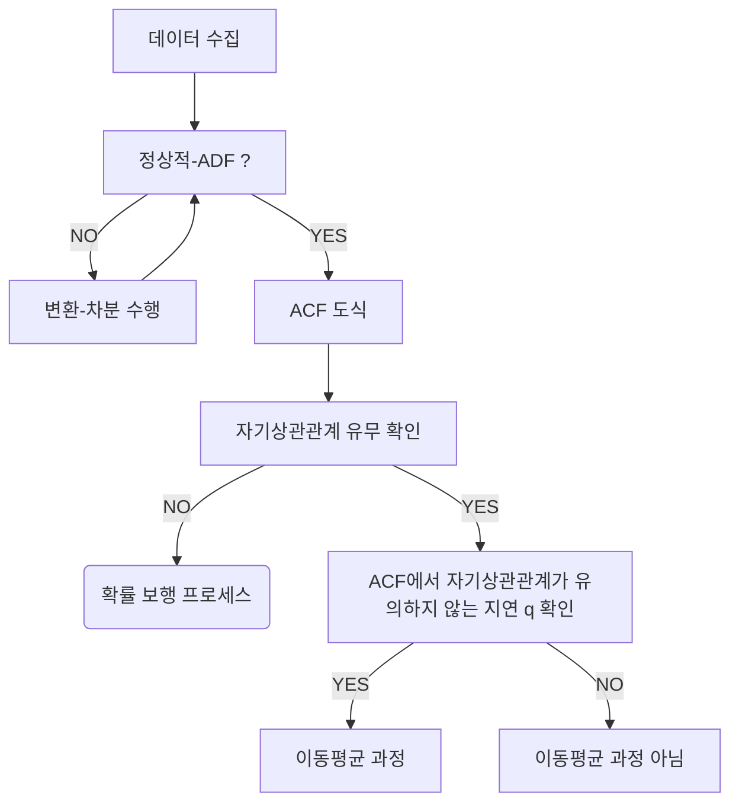

--- 
layout: single
classes: wide
title: "[TimeSeries] MA(Moving Average)"
header:
  overlay_image: /img/data-science-bg.jpg
excerpt: '이동평균(MA, Moving Average) 프로세스 모델링과 예측에 대해 알아보자'
author: "window_for_sun"
header-style: text
categories :
  - AI/ML
tags:
    - Practice
    - Data Science
    - Time Series
    - MA
    - Moving Average
toc: true
use_math: true
---  

## Moving Average Process
`이동평균(MA, Moving Average)` 는 시계열 데이터의 현재 값이 과거의 백색잡음 항들의 선형결합으로 표현되는 과정을 의미한다. 
다르게 설명하면 현재값이 현재의 과거 오차에 선형적으로 비례한다고 할 수 있다.  
이동평균 모델의 일반적인 표기는 `MA(q)` 를 사용하는데 여기서 `q` 는 이동평균의 차수를 의미한다. 

`q` 는 시게열 모델이 현재 시점의 데이터 값을 설명할 때 얼마나 이전까지의 오차(백색소음) 항을 포함하지는지를 나타내는 숫자이다. 
즉, 몇 시점 전까지의 오차가 현재 값에 명향을 미치는지를 결정하는 파라미터라고 할 수 있다. 
만약 `q` 가 크다면 더 오랜 과거의 오차까지 현재 값에 영향을 미친다고 할 수 있고, 
`q` 가 작다면 최근 오차 항만을 고려한다고 할 수 있다.  


### Order of MA Process
이렇듯 이동평균 과정에서는 `MA(q)` 에서 `q` 를 걸정하는 것이 매우 중요하다.
`q` 를 적절하게 선택하는 이동평균과정의 차수 식별의 과정은 아래와 같다.



이동평균 과정은 이전 `확률보행`에서 언급했던 것 과 같이 `정상적 시계열` 임을 가정한다.
그러므로 정상적이 아니라면 차분을 통해 정상적 시계열로 변환해야 한다.
그리고 나서 `ACF` 를 도식해 유의한 자기상관계수를 찾는다.
만약 `확률보행` 이라면 지연 0이후 유의한 자기상관계수가 없을 것이다.
하지만 유의한 계수를 찾았다면, 지연 `q` 이후 갑자기 계수가 유의하지 않게 되는 지연 `q` 를 찾는다.
이렇게 하면 우리는 `MA(q)` 모델에서 `q` 를 식별할 수 있다.  

이동평균 과정에서 사용할 데이터는 특정 기업의 위젯 판매량 데이터이다.  

```python
import pandas as pd
df = pd.read_csv('../data/widget_sales.csv')

df.head()
#   widget_sales
# 0	50.496714
# 1	50.805493
# 2	51.477758
# 3	53.542228
# 4	54.873108
```  

로드한 데이터를 시계열로 도식화하면 아래와 같다.  

```python
fig, ax = plt.subplots()

ax.plot(df['widget_sales'])
ax.set_xlabel('Time')
ax.set_ylabel('Widget sales (k$)')

plt.xticks(
    [0, 30, 57, 87, 116, 145, 175, 204, 234, 264, 293, 323, 352, 382, 409, 439, 468, 498], 
    ['Jan 2019', 'Feb', 'Mar', 'Apr', 'May', 'Jun', 'Jul', 'Aug', 'Sep', 'Oct', 'Nov', 'Dec', 'Jan 2020', 'Feb', 'Mar', 'Apr', 'May', 'Jun'])

fig.autofmt_xdate()
plt.tight_layout()
```  


그래프를 보았을 때 장기적으로 증가하는 추세를 확인할 수 있다. 
`MA(q)` 를 식별하기 위한 첫 번째 과정은 `ADF` 테스트로 장상성을 확인해 보는 것이다. 

```python
ADF_result = adfuller(df['widget_sales'])

print(f'ADF Statistic: {ADF_result[0]}')
# ADF Statistic: -1.512166206935902
print(f'p-value: {ADF_result[1]}')
# p-value: 0.5274845352272619
```  

`ADF` 통계값이 큰 음수가 아니고, `p-value` 가 0.05 보다 크므로 귀무가설을 기각할 수 없어 정상적이 아닌 시계열임을 확인할 수 있다. 
정상적 시계열로 만들기 위해 변환을 적용하는데 이번에도 차분을 적용한다.  

```python
widget_sales_diff = np.diff(df['widget_sales'], n=1)

fig, ax = plt.subplots()

ax.plot(widget_sales_diff)
ax.set_xlabel('Time')
ax.set_ylabel('Widget sales - diff (k$)')

plt.xticks(
    [0, 30, 57, 87, 116, 145, 175, 204, 234, 264, 293, 323, 352, 382, 409, 439, 468, 498],
    ['Jan', 'Feb', 'Mar', 'Apr', 'May', 'Jun', 'Jul', 'Aug', 'Sep', 'Oct', 'Nov', 'Dec', '2020', 'Feb', 'Mar', 'Apr', 'May', 'Jun'])

fig.autofmt_xdate()
plt.tight_layout()
```  


그래프만 보면 정상적 시계열로 보이지만, 차분한 데이터에 대해서 `ADF` 테스트를 통해 다시 확인해 본다. 

```python
ADF_result = adfuller(widget_sales_diff)

print(f'ADF Statistic: {ADF_result[0]}')
# ADF Statistic: -10.576657780341957
print(f'p-value: {ADF_result[1]}')
# p-value: 7.076922818587346e-19
```  

`ADF` 통계값이 매우 큰 음수이고, `p-value` 가 0.05 보다 훨씬 작으므로 귀무가설을 기각할 수 있어 정상적 시계열임을 확인할 수 있다. 
이제 `ACF` 를 도식해 유의한 자기상관계수를 찾아본다.

```python
plot_acf(widget_sales_diff, lags=30);

plt.tight_layout()
```  


`ACF` 도식을 보면 지연 2까지 유의한 자기상관관계가 있다가 지연 3부터 유의하지 않게 되는 것을 확인할 수 있다. 
물론 지연 20에서 약간의 유의함이 보이지만 이는 우연으로 볼 수 있다. 
이는 차수(`q`) 2의 정상적 이동평균 과정임을 의미하기 때문에 이동평균 모델은 `MA(2)` 임을 알 수 있다.  

### Forecasting MA Process
차수(`q`) 식별 과정을 통해 차수를 2로 식별했으므로 `MA(2)` 모델을 구축할 수 있다. 
이제 `MA(2)` 모델을 구축하고 예측을 수행한다. 
이동평균 모델의 성능을 평가하기 위해 베이스라인 모델도 함께 구축한다.  

항상 모델 구축의 첫 단계는 전체 데이터 세트에 대해서 
훈련 세트와 테스트 세트로 분리하는 것이다. 
차분한 데이터에 대해서 90% 정도를 훈련 세트로 사용하고 나머지 10% 는 테스트 세트로 사용한다.  

```python
df_diff = pd.DataFrame({'widget_sales_diff': widget_sales_diff})

train = df_diff[:int(0.9*len(df_diff))]
test = df_diff[int(0.9*len(df_diff)):]

print(len(train))
# 449
print(len(test))
# 50
```  

훈련 세트와 테스트 세트로 분리한 데이터에 대해서 원본 데이터와 함께 도식화하면 아래와 같다.  

```python
fig, (ax1, ax2) = plt.subplots(nrows=2, ncols=1, sharex=True)

ax1.plot(df['widget_sales'])
ax1.set_xlabel('Time')
ax1.set_ylabel('Widget sales (k$)')
ax1.axvspan(450, 500, color='#808080', alpha=0.2)

ax2.plot(df_diff['widget_sales_diff'])
ax2.set_xlabel('Time')
ax2.set_ylabel('Widget sales - diff (k$)')
ax2.axvspan(449, 498, color='#808080', alpha=0.2)

plt.xticks(
    [0, 30, 57, 87, 116, 145, 175, 204, 234, 264, 293, 323, 352, 382, 409, 439, 468, 498], 
    ['Jan', 'Feb', 'Mar', 'Apr', 'May', 'Jun', 'Jul', 'Aug', 'Sep', 'Oct', 'Nov', 'Dec', '2020', 'Feb', 'Mar', 'Apr', 'May', 'Jun'])

fig.autofmt_xdate()
plt.tight_layout()
```  


구축할 이동평균 모델은 `MA(2)` 이기때문에 한번에 테스트 세트의 수인 50개를 모두 예측할 수는 없다. 
`MA(2)` 모델은 이전 2개의 오차 항에 대해서 선형적으로 의존하는 만큼 향후에 대해서도 최대 2개씩 예측할 수 있다.  

그러므로 50개의 예측을 위해 `rolling forecast` 방식을 사용한다. 
`rolling forecast` 방식은 한번에 1개 혹은 2개씩 예측하고, 
다시 2번째 예측을 위해 훈련 세트의 범위를 예측 개수만큼 늘려가며 향후 예측을 점진적으로 하는 방식이다.  

이동평균 모델의 구축과 예측은 `statsmodels` 패키지의 `SARIMAX` 클래스를 사용한다. 
`SARIMAX` 는 계절성과 자기화귀과정, 비정상적 시게열, 이동평균과정, 외부 변수들에 대한 모델 구축과 예측으 모두 지원한다. 
여기서 이동평균에 대한 파라미터만 사용하면 `MA(q)` 모델을 구축하고 예측을 수행할 수 있다.  

아래는 베이스라인으로 사용할 평균, 마지막 값과 이동평균 모델의 예측을 수행하는 `rolling_forecast` 함수의 구현이다.  

```python
from statsmodels.tsa.statespace.sarimax import SARIMAX

def rolling_forecast(df: pd.DataFrame, train_len: int, horizon: int, window: int, method: str) -> list:
    
    total_len = train_len + horizon
    
    if method == 'mean':
        pred_mean = []
        
        for i in range(train_len, total_len, window):
            mean = np.mean(df[:i].values)
            pred_mean.extend(mean for _ in range(window))

        return pred_mean

    elif method == 'last':
        pred_last_value = []
        
        for i in range(train_len, total_len, window):
            last_value = df[:i].iloc[-1].values[0]
            pred_last_value.extend(last_value for _ in range(window))
            
        return pred_last_value
    
    elif method == 'MA':
        pred_MA = []
        
        for i in range(train_len, total_len, window):
            model = SARIMAX(df[:i], order=(0,0,2))
            res = model.fit(disp=False)
            predictions = res.get_prediction(0, i + window - 1)
            oos_pred = predictions.predicted_mean.iloc[-window:]
            pred_MA.extend(oos_pred)
            
        return pred_MA
```  
