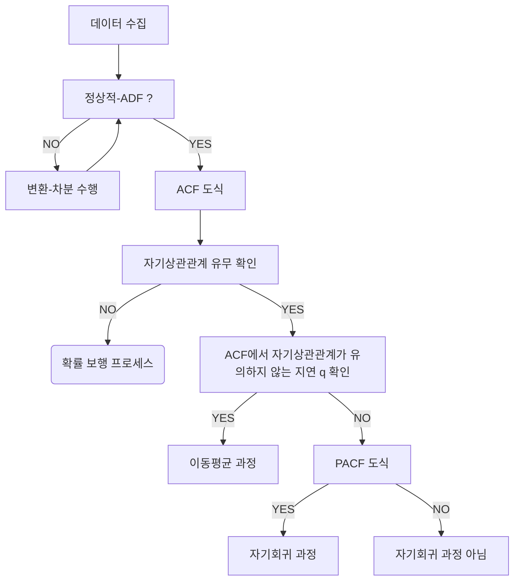

--- 
layout: single
classes: wide
title: "[TimeSeries] AR(AutoRegressive)"
header:
  overlay_image: /img/data-science-bg.jpg
excerpt: '자기회귀(AR, Autoregressive) 프로세스 모델링과 예측에 대해 알아보자'
author: "window_for_sun"
header-style: text
categories :
  - AI/ML
tags:
    - Practice
    - Data Science
    - Time Series
    - AR
    - AutoRegressive
toc: true
use_math: true
---  

## Autoregressive Process
`Autoregressive Process`(자기회귀 과정, AR)는 시계열 분석에서 널리 사용되는 통계 모델이다. 
현재의 데이터 값이 과거의 자기 자신의 값들의 선형 결합(가중합)으로 표현되는 과정을 의미한다. (현재값이 과거값에 선형적으로 의존)
현재 시점의 값이 바로 이전 시점이나 그보다 더 이전 시점의 값들에 일정한 계수를 곱해 더한 값과, 
우연적 오차(백색잡음)가 더해 만들어지는 시계열 모델이라고 할 수 있다. 
즉, 과거의 값들이 현재 값에 영향을 주는 자기 의존적 구조를 가진 모델이다.  

앞서 살펴본 `MA` 이동평균에서도 `ACF` 도식을 보면 과거 몇개의 오차항에 대해 의존하는 것을 볼 수 있었다. 
여기서 `MA` 는 현재 값이 과저의 오차(백색잡음) 에만 의존하는 것을 의미한다. 
즉 이는 직접적으로 과저의 실제 데이터 값들이 아니라, 당시 발생했던 오차항에만 의존하는 것이다.
이와 비교해 `AR` 자기회귀는 현재 값이 과거의 실제 데이터 값에 직접적으로 의존하는 것을 의미한다.  

자가회귀 모델은 `AR(p)` 로 표기하는데 , 여기서 `p` 는 모델이 의존하는 과거 시점의 수를 나타낸다. 
예를 들어, `AR(1)` 모델은 바로 이전 시점의 값에만 의존하고, 
`AR(2)` 모델은 바로 이전 시점과 그 이전 시점의 값에 의존한다는 것을 의미한다. 


### Order of AR Process
이동평균과 마찬가지로 이동평균에서는 `MA(q)` 에서 `q` 를 식별하는 과정이 매우 중요했듯이, 
자기회귀에서는 `AR(p)` 에서 `p` 를 식별하는 과정이 매우 중요하다. 

이동평균에서 `q` 를 식별하는 과정을 확장해 `AR` 에서 `p` 를 식별하는 과정은 다음과 같다. 



이동평균 차수 삭별과정에서 `PACF` 도식이 추가되어 `AR` 자기회귀 과정의 지연 `p` 를 식별하는데 사용한다.  

자기회귀 과정에서는 예제를 위해 소매점의 주간 평균 유동인구를 사용한다. 

```python
df = pd.read_csv('../data/foot_traffic.csv')

df.head()
#   foot_traffic
# 0	500.496714
# 1	500.522366
# 2	501.426876
# 3	503.295990
# 4	504.132695

fig, ax = plt.subplots()

ax.plot(df['foot_traffic'])
ax.set_xlabel('Time')
ax.set_ylabel('Average weekly foot traffic')

plt.xticks(np.arange(0, 1000, 104), np.arange(2000, 2020, 2))

fig.autofmt_xdate()
plt.tight_layout()
```  
