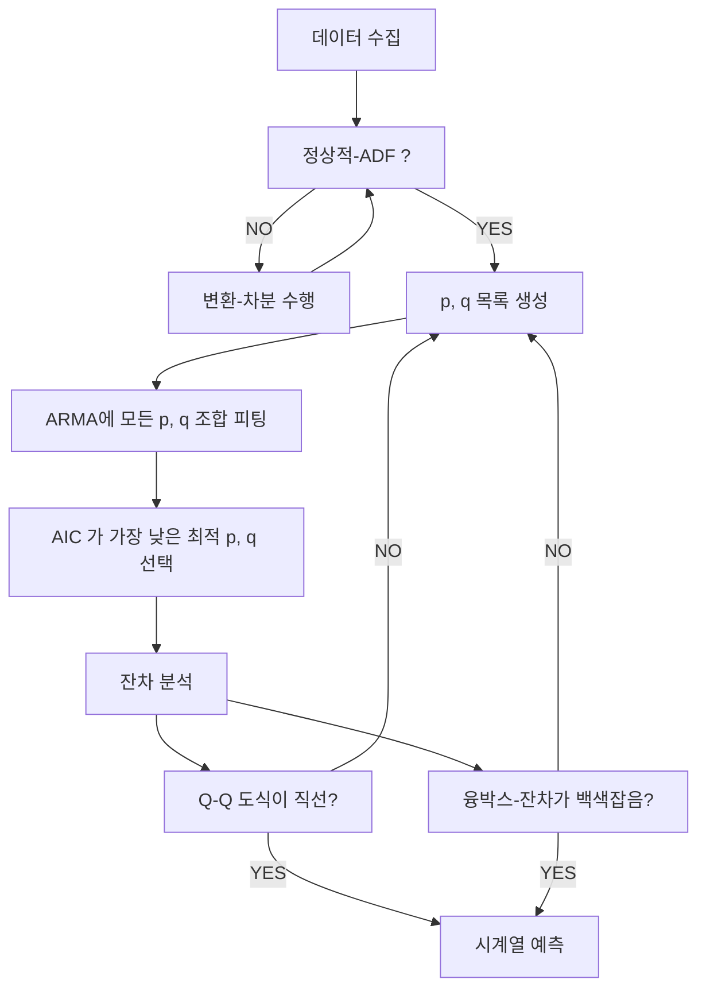

--- 
layout: single
classes: wide
title: "[Time] ARMA"
header:
  overlay_image: /img/data-science-bg.jpg
excerpt: '자기회귀와 이동평균 두 가지 구성요소를 결합한 모델인 ARMA 에 대해 알아보자'
author: "window_for_sun"
header-style: text
categories :
  - AI/ML
tags:
    - Practice
    - Data Science
    - Time Series
    - AR
    - MA
    - ARMA
toc: true
use_math: true
---  

## Autoregressive Moving Average (ARMA) Model
`ARMA`(Autoregressive Moving Average, 자기회귀 이동평균) 모델은 시계열 데이터 예측 및 분석에 널리 사용되는 통계적 모델 중 하나로, 
자기회귀(`AR`)와 이동평균(`MA`) 두 가지 구성 요소를 결합한 모델이다. 
시계열의 현재 값이 과거의 값들과 과거의 오차항의 선형 결합으로 표현된다는 점에서,
`ARMA` 모델은 시간에 따라 상호 관련성이 존재하는 데이터를 효과적으로 설명할 수 있다. 

`ARMA` 모델은 `ACF` 도식이나 `PACF` 도식에서 차수를 추정할 수 없는 경우에 사용할 수 있다. 
두 도식 모두 천천히 감쇄하는 패턴이나 사인 곡선 패턴을 나타내는 경우이다. 

`MA`, `AR`m `ARMA` 모델을 비교하면 아래와 같다.  

| 구분    | AR (자기회귀) | MA (이동평균) | ARMA (자기회귀 이동평균) |
|---------|---------------|--------------|--------------------------|
| 모델 구조 | 과거의 값에 의존 | 과거 오차에 의존 | 과거 값 + 과거 오차에 모두 의존 |
| 파라미터 | AR 계수(p개) | MA 계수(q개) | AR 계수(p개) + MA 계수(q개) |
| 데이터 패턴 | 자기상관이 강한 데이터 | 오차의 자기상관이 강한 데이터 | 두 패턴이 모두 존재할 때 적합 |
| 예측력 | 단순 패턴에 적합 | 단순 패턴에 적합 | 복합 패턴에 적합, 예측력 우수 |

`ARMA` 모델링을 위해서는 `AIC`(Akaike Information Criterion, 아카이케 정보 기준) 을 사용한다. 
이를 통해 시게열에 대한 최적으 `p`, `q` 값을 결정하고, 
모델 잔차의 상관관계도 `Q-Q` 도식과 밀도 도식을 사용하는 `잔자 분석` 을 통해 잔차가 백섹소음과 유사한지 평가한다. 
`잔자 분석`을 통해 유효한 것으로 판정되면 `ARMA` 모델을 통해 시게열 예측을 수행해 볼 수 있다.  


`ARMA` 모델을 사용해서 데이터 세넡의 대역폭 사용량을 예측해 본다.
먼저 2019년 1월 부터 특정된 시간당 대역폭 데이터를 사용한다.
대역폭은 초당 메가비트(Mbps) 단위로 측정되었다.
원본 데이터를 도식화하면 아래와 같다.

```python
import matplotlib.pyplot as plt
import pandas as pd

df = pd.read_csv('../data/bandwidth.csv')

df.head()

fig, ax = plt.subplots()

ax.plot(df['hourly_bandwidth'])
ax.set_xlabel('Time')
ax.set_ylabel('Hourly bandwith usage (MBps)')

plt.xticks(
    np.arange(0, 10000, 730), 
    ['Jan 2019', 'Feb', 'Mar', 'Apr', 'May', 'Jun', 'Jul', 'Aug', 'Sep', 'Oct', 'Nov', 'Dec', 'Jan 2020', 'Feb'])

fig.autofmt_xdate()
plt.tight_layout()
```   


데이터를 보면 장기적인 추세가 있으므로 정상적은 아닌 것으로 보인다. 
그리고 주기적인 형태는 없어 계절성은 존재하지 않는 것으로 보인다. 
이후 `ARMA` 모델의 모델링 절차를 살펴보고 이게 맞춰 진행해 본다.  

### AIC
`AIC`(Akaike Information Criterion, 아카이케 정보 기준)는 통계 모델의 품질을 평가하는 데 사용되는 지표이다. 
모델의 품질을 다른 모델들과 비교하여 상대적으로 정량화한다. 
데이터에 피팅할 때 일부 정보는 손실되는데 `AIC` 는 모델에 의해 손실되는 정보의 양을 상대적으로 정량화하고, 
모델들을 정량적으로 비교할 수 있다. 
`AIC` 값이 낮을 수록 손실된 정보가 적다는 의미이므로 더 우수한 모델로 판단할 수 있다.  


### Order of ARMA Process
`ARMA` 모델에서도 `ARMA(p, q)` 에서 `p`, `q` 를 식별하는 과정이 매우 중요하다. 
`p` 는 `AR` 자기회귀 차수를 나타내고, `q` 는 `MA` 이동평균 차수를 나타낸다. 
`ARMA` 모델에서 `p`, `q` 를 식별하는 모델링 과정은 다음과 같다.  



`ADF` 를 사용해 현재 시계열 데이터가 정상적인지 확인한다.  

```python
ADF_result = adfuller(df['hourly_bandwidth'])

print(f'ADF Statistic: {ADF_result[0]}')
# ADF Statistic: -0.8714653199452314
print(f'p-value: {ADF_result[1]}')
# p-value: 0.7972240255014685
```  

`ADF` 통계값이 큰 음수가 아니고, `p-value` 가 `0.05` 보다 크므로 시계열은 정상적이지 않다.
데이터를 정상적으로 만들기 위해 변환(차분)을 수행해 다시 `ADF` 검정을 수행한다.  

```python
bandwidth_diff = np.diff(df.hourly_bandwidth, n=1)

fig, ax = plt.subplots()

ax.plot(bandwidth_diff)
ax.set_xlabel('Time')
ax.set_ylabel('Hourly bandwith usage - diff (MBps)')

plt.xticks(
    np.arange(0, 10000, 730),
    ['Jan', 'Feb', 'Mar', 'Apr', 'May', 'Jun', 'Jul', 'Aug', 'Sep', 'Oct', 'Nov', 'Dec', '2020', 'Feb'])

fig.autofmt_xdate()
plt.tight_layout()

ADF_result = adfuller(bandwidth_diff)

print(f'ADF Statistic: {ADF_result[0]}')
# ADF Statistic: -20.69485386378902
print(f'p-value: {ADF_result[1]}')
# p-value: 0.0
```  


차준 데이터의 도식화된 모습과 `ADF` 통계값 그리고 `p-value` 를 보면 정상적인 시계열임을 알 수 있다. 
정상적 시계열을 확보했으면 이제 `ARMA(p,q)` 모델을 사용해 정상적 프로세스를 모델링할 준비가 된 것이다.  


> 추가로 해당 시계열에 `MA` 혹은 `AR` 모델을 적용할 수 있을지 확인하기 위해 `ACF` 와 `PACF` 도식을 그려본다.  
> 
> ```python
> plot_acf(bandwidth_diff, lags=20);
> 
> plt.tight_layout()
> ```  
> 
> 

> 
> 
> ```python
> plot_pacf(bandwidth_diff, lags=20);
> 
> plt.tight_layout()
> ```  
> 
> 

> 
> 
> `ACF` 도식을 보면 자기상관 계수는 지연이 증가함에 따라 점차 감소하는 것을 볼 수 있다. 
> 하지만 특정 지연 후 계수가 갑작스럽게 유의하지 않게되는 특징은 보이지 않는다. 
> 이는 이동평균 과정이라고는 할 수 없고 데이터에 자기회귀과정이 있을 가능성을 시사한다. 
> `PACF` 도식을 보면 지연 1이후에 계수가 크게 줄어 든 것을 볼 수 있지만, 이를 `AR(1)` 모델로 단정짓기에는 부족하다.
> 마치 이후에도 지속적으로 유의한 계수가 사인 곡선을 그리는 것과 같이 보이기 때문이다. 
> 그러므로 해당 데이터는 자기회귀 과정과 이동평균 과정이 모두 존재하는 `ARMA` 모델을 적용해 보는 것이 타당하다.  


가장 먼저 수행해야 할 것은 훈련 집합과 테스트 집합으로 분할하는 것이다. 
테스트 집합은 최근 7일간의 데이터를 사용하고 그 외 데이터는 모두 훈련 집합으로 사용한다.  

```python
df_diff = pd.DataFrame({'bandwidth_diff': bandwidth_diff})

train = df_diff[:-168]
test = df_diff[-168:]

print(len(train))
# 9831
print(len(test))
# 168
```  

테스트 세트와 훈련 세트로 나누어진 집합에 대해서 원본과 차분 데이터를 함께 도식하면 아래와 같다.  

```python
fig, (ax1, ax2) = plt.subplots(nrows=2, ncols=1, sharex=True, figsize=(10, 8))

ax1.plot(df['hourly_bandwidth'])
ax1.set_xlabel('Time')
ax1.set_ylabel('Hourly bandwidth usage (MBps)')
ax1.axvspan(9831, 10000, color='#808080', alpha=0.2)

ax2.plot(df_diff['bandwidth_diff'])
ax2.set_xlabel('Time')
ax2.set_ylabel('Hourly bandwidth - diff (MBps)')
ax2.axvspan(9830, 9999, color='#808080', alpha=0.2)

plt.xticks(
    np.arange(0, 10000, 730), 
    ['Jan', 'Feb', 'Mar', 'Apr', 'May', 'Jun', 'Jul', 'Aug', 'Sep', 'Oct', 'Nov', 'Dec', '2020', 'Feb'])

fig.autofmt_xdate()
plt.tight_layout()
```  


다음 단계는 `p`, `q` 의 후보 목록을 생성하고 이를 모든 조합에 대해 `ARMA` 모델을 피팅하는 것이다. 
이 떄 `ARMA` 모델을 피팅하는 `optimize_ARMA` 함수를 아래와 같이 정의한다.  

```python
from typing import Union
from tqdm.notebook import tqdm_notebook
from statsmodels.tsa.statespace.sarimax import SARIMAX

def optimize_ARMA(endog: Union[pd.Series, list], order_list: list) -> pd.DataFrame:
    
    results = []
    
    for order in tqdm_notebook(order_list):
        try: 
            model = SARIMAX(endog, order=(order[0], 0, order[1]), simple_differencing=False).fit(disp=False)
        except:
            continue
            
        aic = model.aic
        results.append([order, aic])
        
    result_df = pd.DataFrame(results)
    result_df.columns = ['(p,q)', 'AIC']
    
    #Sort in ascending order, lower AIC is better
    result_df = result_df.sort_values(by='AIC', ascending=True).reset_index(drop=True)
    
    return result_df
```  

`optimize_ARMA` 함수는 `endog` 매개변수로 시계열 데이터를 받고,
`order_list` 매개변수로 `p`, `q` 의 후보 목록을 받는다. 
그리고 `p`, `q` 의 모든 조합에 대해 `SARIMAX` 클래스를 사용해 `ARMA` 모델을 피팅하고, 
각 조합에 대한 `AIC` 값을 계산해 데이터 프레임으로 반환한다.  

`p`, `q` 의 후보 목록은 `0` 부터 `4` 까지의 정수로 생성한다. 
이는 어떠한 기준에 의해서 결정된 것이 아니라 단순히 예시를 위한 것이다.  

```python
ps = range(0, 4, 1)
qs = range(0, 4, 1)

order_list = list(product(ps, qs))
```  

이제 조합된 `p`, `q` 목록을 사용해 `optimize_ARMA` 함수를 호출한다.  

```python
result_df = optimize_ARMA(train['bandwidth_diff'], order_list)

#       (p,q)	AIC
# 0	    (3, 2)	27991.063879
# 1	    (2, 3)	27991.287509
# 2	    (2, 2)	27991.603598
# 3	    (3, 3)	27993.416924
# 4	    (1, 3)	28003.349550
# 5	    (1, 2)	28051.351401
# 6	    (3, 1)	28071.155496
# 7	    (3, 0)	28095.618186
# 8	    (2, 1)	28097.250766
# 9	    (2, 0)	28098.407664
# 10	(1, 1)	28172.510044
# 11	(1, 0)	28941.056983
# 12	(0, 3)	31355.802141
# 13	(0, 2)	33531.179284
# 14	(0, 1)	39402.269523
# 15	(0, 0)	49035.184224
```  

`AIC` 값이 낮은 순으로 결과를 보았을 때 `(3, 2)` 또는 `(2, 3)` 조합이 가장 낮지만, 
그 다음 `(2, 2)` 조합과 차이가 없다 그러므로 추정에 필요한 매개변수가 좀 더 적은 `(2, 2)` 조합을 선택한다.  

### Residual Analysis
`p`, `q` 조합을 통해 다양한 `ARMA(p, q)` 모델을 피팅하고 비교해 `AIC` 선택 기준으로 사용하여 가장 적합한 모델을 도출했다. 
이제 남은 것은 선정된 모델의 잔차에 대한 분석을 수행해 절대적 품질을 측정하는 것이다. 
이는 예측 전 마지막 단계이고 잔차 분석을 수행해 `Q-Q` 도식이 직선인가 ? 
그리고 `Ljung-Box` 검정을 통해 잔차가 상관관계가 없는 백색잡음인가 ? 를 확인한다. 
만약 둘다 만족한다면 예측을 수행할 수 있고, 아니라면 다른 `p`, `q` 조합을 선택해 다시 모델링을 수행해야 한다.  

먼저 `Q-Q` 도식은 모델의 잔차가 정규분포라는 가설을 검증하기 위한 시각적 도구이다. 
`Q-Q` 도식은 두 분포의 분위를 비교하여 분포의 유사성, 특히 정상성을 시각적으로 평가하는 그래프이다. 
잔차 분석에서는 회귀 모델이나 시계열 모델의 잔차(`residuals`)가 정규분포를 따르는지 확인할 때 자주 사용한다. 
잔차의 분포가 정규분포와 유사하다면 `y = x` 직선에 위에 까가운 형태로 나타난다. 
이는 잔차가 백색소음과 유사하여 모델의 적합도가 좋다는 의미이다.  

반면 잔차의 분포가 정규분포와 다르면 곡선을 볼 수 있고, 
이는 잔차의 분포가 정규분포에 가깝지 않고 잔차가 백색소음과 유사하지 않아 적합하지 않은 모델로 판단할 수 있다.  

다음으로 융-박스(`Ljung-Box`) 검정은 시계열 데이터의 자기상관성을 평가하는 통계적 검정이다. 
성능적으로 좋은 모델은 잔차가 백색소음과 유사하므로 잔차가 정규분포이면서 잔차 간에 상관관계가 없어야 한다.  
융-박스 테스트는 데이터 집단의 자기상관관계가 0과 유의하게 다른지 판단하는 통계적 검사이다. 
`p-value` 가 `0.05` 크면 데이터가 독립적으로 분포되어 있다는 귀무가설을 기각할 수 없어, 
이는 잔차가 독립적으로 분포한다는 것을 뜻한다. (자기상관관계가 없는 백색소음)


개념적인 설명을 마쳤으면, 이제 선정된 `ARMA(2, 2)` 모델을 사용해 잔차 분석을 수행해 본다.  
`Q-Q` 도식의 경우 `plot_diagnostics` 메서드를 사용해 쉽게 그릴 수 있다.  

```python
model = SARIMAX(train['bandwidth_diff'], order=(2,0,2), simple_differencing=False)
model_fit = model.fit(disp=False)
print(model_fit.summary())
# SARIMAX Results
# ==============================================================================
# Dep. Variable:         bandwidth_diff   No. Observations:                 9831
# Model:               SARIMAX(2, 0, 2)   Log Likelihood              -13990.802
# Date:                Mon, 10 Jan 2022   AIC                          27991.604
# Time:                        13:38:42   BIC                          28027.570
# Sample:                             0   HQIC                         28003.788
# - 9831
# Covariance Type:                  opg
# ==============================================================================
# coef    std err          z      P>|z|      [0.025      0.975]
# ------------------------------------------------------------------------------
# ar.L1          0.3486      0.052      6.765      0.000       0.248       0.450
# ar.L2          0.4743      0.047     10.000      0.000       0.381       0.567
# ma.L1          0.8667      0.050     17.249      0.000       0.768       0.965
# ma.L2          0.2807      0.015     19.233      0.000       0.252       0.309
# sigma2         1.0082      0.014     70.654      0.000       0.980       1.036
# ===================================================================================
# Ljung-Box (L1) (Q):                   0.04   Jarque-Bera (JB):                 0.50
# Prob(Q):                              0.84   Prob(JB):                         0.78
# Heteroskedasticity (H):               1.06   Skew:                             0.00
# Prob(H) (two-sided):                  0.12   Kurtosis:                         3.03
# ===================================================================================
# 
# Warnings:
# [1] Covariance matrix calculated using the outer product of gradients (complex-step).

model_fit.plot_diagnostics(figsize=(10, 8))

```  
