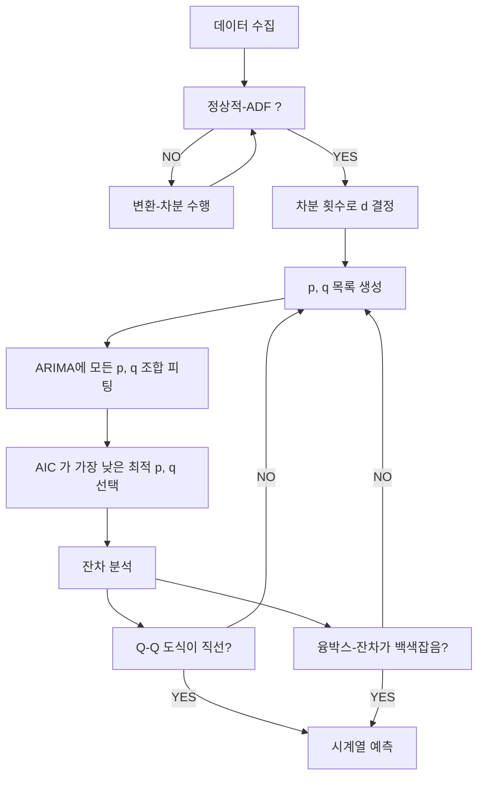

--- 
layout: single
classes: wide
title: "[Time] ARIMA"
header:
  overlay_image: /img/data-science-bg.jpg
excerpt: '자기회귀와 이동평균을 결합한 ARMA에 누적 과정을 추가한 ARIMA 에 대해 알아보자'
author: "window_for_sun"
header-style: text
categories :
  - AI/ML
tags:
    - Practice
    - Data Science
    - Time Series
    - AR
    - MA
    - ARMA
    - ARIMA
toc: true
use_math: true
---  

## Autoregressive Integrated Moving Average (ARIMA) Model
`ARIMA`(Autoregressive Integrated Moving Average) 모델은 시계열 데이터 분석 및 분석에 널리 사용되는 통계 모델이다. 
`AR(자기회귀)`, `MA(이동평균)` 모델을 결합한 `ARMA` 모델에 누적(적분, `Integrated`) 과정을 추가하여 
비정상(`non-stationary`) 시계열 데이터까지 다룰 수 있도록 확장한 모델이다.  

`ARIMA` 모델은 시계열 데이터가 정상성을 만족하지 않을 때, 
차분(`differencing`) 과정을 통해 정상성을 갖도록 변환 후 `ARMA` 모델을 적용하는 방식이고, 
이는 `ARIMA(p,d,q)` 로 표기한다. 
여기서 `p` 는 자기회귀 차수, `d` 는 차분 횟수, `q` 는 이동평균 차수를 의미한다. 
`ARIMA` 모델은 금융, 경제, 산업 등 다양한 분야에서 시계열 예측에 활용되며, 정상성과 비정상성을 모두 처리할 수 있다는 장점이 있다. 
모델 선택시, 데이터의 정상성 여부를 먼저 확인하고 적절한 차분을 적용해야 하고, 예측력과 유연성이 높아 복합적인 시게열 패턴에 적합하다.  

`MA`, `AR`, `ARMA`, `ARIMA` 모델의 비교는 아래 표와 같다.

| 구분    | AR (자기회귀) | MA (이동평균) | ARMA (자기회귀 이동평균) | ARIMA (자기회귀 누적 이동평균) |
|---------|---------------|--------------|--------------------------|-------------------------------|
| 모델 구조 | 과거의 값에 의존 | 과거 오차에 의존 | 과거 값 + 과거 오차 | 차분 후 과거 값 + 오차 |
| 정상성 가정 | 정상 데이터 | 정상 데이터 | 정상 데이터 | 비정상/정상 모두 가능 |
| 파라미터 | p | q | p, q | p, d, q |
| 적용 데이터 | 단순 정상 시계열 | 단순 정상 시계열 | 복합 정상 시계열 | 복합 비정상 및 정상 시계열 |
| 예측력 | 보통 | 보통 | 높음 | 매우 높음 |
| 특징 | 자기상관이 강한 데이터에 적합 | 오차의 자기상관이 강할 때 적합 | 두 패턴 혼재시 적합 | 정상화 과정 포함, 유연성 최고 |


### Order of ARIMA Model
`ARIMA` 모델에서도 `ARIMA(p,d,q)` 에서 `p`, `d`, `q` 를 식별하는 과정이 매우 중요하다.
`p` 는 `AR` 자기회귀 차수를 나타내고, `q` 는 `MA` 이동평균 차수, `d` 는 차분 횟수를 나타낸다. 
`ARIMA` 모델에서 `p`, `d`, `q` 를 식별하는 모델링 과정은 다음과 같다.  



`ARIMA` 모델에서는 `1960~1980` 년 사이의 존슨앤드존스의 분기별 주당순이익 데이터를 사용한다. 
데이터를 로드하고 도식화하면 아래와 같다.  

```python
df = pd.read_csv('../data/jj.csv')
df.head()
#   date	    data
# 0	1960-01-01	0.71
# 1	1960-04-01	0.63
# 2	1960-07-02	0.85
# 3	1960-10-01	0.44
# 4	1961-01-01	0.61


fig, ax = plt.subplots()

ax.plot(df.date, df.data)
ax.set_xlabel('Date')
ax.set_ylabel('Earnings per share (USD)')
ax.axvspan(80, 83, color='#808080', alpha=0.2)

plt.xticks(np.arange(0, 81, 8), [1960, 1962, 1964, 1966, 1968, 1970, 1972, 1974, 1976, 1978, 1980])

fig.autofmt_xdate()
plt.tight_layout()
```  
