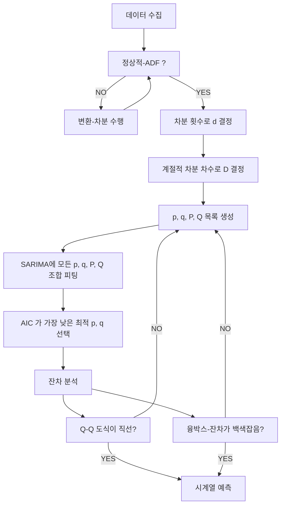

--- 
layout: single
classes: wide
title: "[Time] SARIMA"
header:
  overlay_image: /img/data-science-bg.jpg
excerpt: '시계열 데이터 예측 및 분석의 ARIMA 에서 계절 자기회귀와 계절 이동평균 그리고 계절 차분을 추가한 SARIMA 에 대해 알아보자.'
author: "window_for_sun"
header-style: text
categories :
  - Data Science
tags:
    - Practice
    - Data Science
    - Time Series
    - AR
    - MA
    - ARMA
    - ARIMA
    - SARIMA
toc: true
use_math: true
---  

## Seaonal ARIMA (SARIMA) Model
`Seasonal ARIMA (SARIMA)` 모델은 시계열 데이터에서 예측 및 분석에서 계절성을 포함하는 
복합적인 패턴을 효과적으로 설명하기 위해 사용되는 확장된 통계 모델이다. 
`SARIMA` 는 `ARIMA` 모델에 계절 자기회귀 `Seasonal AR`, 계절 이동평균 `Seasonal MA` 
그리고 계절 차분 `Seasonal Differencing` 을 추가해, 
데이터 내 단기적 변화뿐만 아니라 일정 주기의 반복적인 변동(계절성)을 동시에 포착할 수 있다. 

일반적으로 `SARIMA(p,d,q)(P,D,Q)m` 로 표기하며, 
앞의 `(p,d,q)` 는 `ARIMA` 의 비계절 차수, 
뒤의 `(P,D,Q)m` 는 계절 `AR`, 계절 차분, 계절 `MA`, `m` 는 계절 주기를(`12개월`, `4개월` 등) 의미한다. 
`SARIMA` 는 비정상성과 계절성 모두를 처리 가능하며, 
연간/월간/주간 등 주기적 특성이 강한 경제, 기후, 생산량 등 더욱 폭 넓은 시계열 데이터 분석에 널리 활용된다.  

`MA`, `AR`, `ARMA`, `ARIMA`, `SARIMA` 모델과의 차이점은 다음 표와 같다.

| 구분    | AR (자기회귀) | MA (이동평균) | ARMA (자기회귀 이동평균) | ARIMA (자기회귀 누적 이동평균) | SARIMA (계절 자기회귀 누적 이동평균) |
|---------|---------------|--------------|--------------------------|-------------------------------|--------------------------------------|
| 모델 구조 | 과거의 값에 의존 | 과거 오차에 의존 | 과거 값 + 과거 오차 | 차분 후 과거 값 + 오차 | 계절 차분 후 과거 값, 오차, 계절성 패턴 |
| 정상성 가정 | 정상 데이터 | 정상 데이터 | 정상 데이터 | 비정상/정상 모두 가능 | 비정상, 계절성 모두 가능 |
| 파라미터 | p | q | p, q | p, d, q | p, d, q, P, D, Q, s |
| 적용 데이터 | 단순 정상 시계열 | 단순 정상 시계열 | 복합 정상 시계열 | 복합 비정상 및 정상 시계열 | 계절적·비계절적 복합 시계열 |
| 예측력 | 보통 | 보통 | 높음 | 매우 높음 | 계절성 데이터에 최고 |
| 특징 | 자기상관이 강한 데이터에 적합 | 오차의 자기상관이 강할 때 적합 | 두 패턴 혼재시 적합 | 정상화 과정 포함, 유연성 최고 | 계절성·비정상성 모두 처리, 복잡한 패턴 분석 가능 |


`SARIMA` 모델에서는 `1949~1960` 년까지 항공사의 월별 총 항공 승객 수 데이터를 사용해
시계열 분석하고 최종적으로 `SARIMA` 모델을 구축하는 과정을 단계별로 설명한다. 
해딩 데이터를 로드하고 도식화하면 아래와 같다.  

```python
df = pd.read_csv('../data/air-passengers.csv')
df.head()
# Month	Passengers
# 0	    1949-01	112
# 1	    1949-02	118
# 2	    1949-03	132
# 3	    1949-04	129
# 4	    1949-05	121

fig, ax = plt.subplots()

ax.plot(df['Month'], df['Passengers'])
ax.set_xlabel('Date')
ax.set_ylabel('Number of air passengers')

plt.xticks(np.arange(0, 145, 12), np.arange(1949, 1962, 1))

fig.autofmt_xdate()
plt.tight_layout()
```  


### Seasonal Parameter, m
계절 변수 `m` 은 시계열 데이터에서 계절성 패턴의 주기(빈도)를 나타내는 중요한 파라미터이다.
예를 들어, 월별 데이터에서 `m=12` 는 12개월 주기의 계절성을 의미하며, 
분기별 데이터에서는 `m=4` 가 된다.  

만약 데이터가 일별 또는 일 하위 시간 단계로 수집된다면 빈도의 해석 방법은 여러가지가 있다. 
일별 데이터는 주간 계절성을 가질 수 있으므로 1주는 7일이고 7번 관측이 있어 `m=7` 이 된다. 
또한 연간 계절성이 있다면 `m=365` 가 될 수 있다. 
정리하면 일별 데이터와 일 하위 시간 단계 데이터는 서로 다른 주기를 가질 수 있고, 
다른 `m` 값을 가질 수 있다. 
이를 표로 정리하면 아래와 같다.  

| 데이터 수집 빈도 | 해석 단위 | 적합한 m 값 (계절성 주기) |
|------------------|----------|----------|
| 연간             | 년       | 1           |
| 분기별           | 년       | 4            |
|                  | 분기     | 1          |
| 월간             | 년       | 12          |
|                  | 분기     | 3          |
|                  | 월       | 1         |
| 주간             | 년       | 52          |
|                  | 분기     | 13         |
|                  | 월       | 4         |
|                  | 주       | 1         |
| 일간             | 년       | 365         |
|                  | 분기     | 90         |
|                  | 월       | 30        |
|                  | 주       | 7         |
|                  | 일       | 1         |
| 시간별           | 년       | 8760         |
|                  | 분기     | 2160       |
|                  | 월       | 720       |
|                  | 주       | 168       |
|                  | 일       | 24        |
|                  | 시간     | 1          |
| 매분             | 년       | 525600      |
|                  | 분기     | 129600     |
|                  | 월       | 43200     |
|                  | 주       | 10080     |
|                  | 일       | 1440      |
|                  | 시간     | 60         |
|                  | 분       | 1         |
| 매초             | 년       | 31557600    |
|                  | 분기     | 777600     |
|                  | 월       | 2592000   |
|                  | 주       | 604800    |
|                  | 일       | 86400     |
|                  | 시간     | 3600       |
|                  | 분       | 60        |
|                  | 초       | 1         |

이 값은 데이터의 계절적 변동을 포착하는 데 필수적이며, 
적절한 `m` 값 설정은 `SARIMA` 모델의 성능에 큰 영향을 미친다. 
잘못된 `m` 값은 모델이 계절성을 제대로 반영하지 못하게 하여 예측 정확도를 떨어뜨릴 수 있다. 
따라서, `m` 값은 데이터의 특성과 도메인 지식을 고려하여 신중하게 선택해야 한다.  

최종적으로 사용하는 데이터는 월별 데이터이므로 `m=12` 로 설정한다.  


### Identifying Seasonality
`SARIMA` 모델을 구축하기 전에 데이터의 계절성을 식별하는 것이 중요하다. 
일반적으로 시계열 데이터는 도식화하는 것만으로 주기적인 패턴을 관찰해 계절성을 어느정도는 파악할 수 있다. 
하지만 좀 더 정확한 방법을 사용하고 싶다면 `시계열 분해` 를 사용할 수 있다. 
`시계열 분해는` 는 시계열을 추세 구성요서, 계절적 구성요소, 잔차와 같은 3가지 주요 구성요소로 분리하는 통계 작업이다.  

추세 구성요소는 시계열의 장기적인 변화를 의미하기 때문에 시간이 지남에 따라 증가하거나 감소하는 시계열을 파악할 수 있다. 
계절적 구성요소는 일정한 주기로 반복되는 패턴을 나타내며,
예를 들어, 월별 데이터에서 특정 월에 판매량이 증가하는 패턴을 식별할 수 있다. 
잔차는 시계열의 나머지 부분으로, 노이즈로 추세 또는 계절적 구성요소로 설명할 수 없는 불규칙성을 의미한다.  

`시계열 분히` sms `statsmodels` 의 `STL` 함수를 사용해 수행할 수 있다.  

```python
decomposition = STL(df['Passengers'], period=12).fit()

fig, (ax1, ax2, ax3, ax4) = plt.subplots(nrows=4, ncols=1, sharex=True, figsize=(10,8))

ax1.plot(decomposition.observed)
ax1.set_ylabel('Observed')

ax2.plot(decomposition.trend)
ax2.set_ylabel('Trend')

ax3.plot(decomposition.seasonal)
ax3.set_ylabel('Seasonal')

ax4.plot(decomposition.resid)
ax4.set_ylabel('Residuals')

plt.xticks(np.arange(0, 145, 12), np.arange(1949, 1962, 1))

fig.autofmt_xdate()
plt.tight_layout()
```  


위 결과는 사용하고자 하는 항공 승객에 대한 월별 데이터를 사용한 것이다. 
첫 번째 그래프는 관찰된 데이터 자체를 보여준다. 
두 번째 도식은 시간이 지남에 따라 한곡 승객 수가 증가하는 추세를 나타내고 있다. 
세 번째 도식은 계절적 구성요소를 표시하는데, 시간 흐름에 따랄 반복되는 패턴이 명확함을 볼 수 있다. 
마지막 도식은 추세 또는 계절적 구성요소로 설명할 수 없는 데이터의 변동인 잔차를 보여준다.
만약 계절적 패턴이 없다면 세 번째 도식이 0에서 평평한 수평선을 보이게 된다. 

결론적으로 시계열에서 계절성을 수치적으로 평가하는 통계적 테스트는 없기 때문에 이러한 `시계열 분해`를 통해 판단해야 한다.  

### Forecasting ARIMA
`SARIMA` 모델을 구축하기 전에 `ARIMA` 모델을 먼저 구축해 본다. 
그래서 이후 `SARIMA` 모델과 비교할 수 있도록 한다. 
`ARIMA(p,d,q)` 모델을 구축하기 위해 적절한 `p`, `d`, `q` 값을 찾아야 한다.  

참고로 훈련 세트는 `1960`년 이전의 데이터를 사용하고 테스트 세트는 `1960`년 데이터를 사용할 것이다.

먼저 정상성 검정을 위해 `ADF` 검정을 수행한다.  

```python
ad_fuller_result = adfuller(df['Passengers'])

print(f'ADF Statistic: {ad_fuller_result[0]}')
# ADF Statistic: 0.8153688792060569
print(f'p-value: {ad_fuller_result[1]}')
# p-value: 0.9918802434376411
```  

`ADF` 통계값이 큰 음수가 아니고, `p-value` 가 `0.05` 보다 크므로 귀무가설을 기각할 수 없으므로 정상적인 시계열이 아니다. 
변환을 위해 차분을 적용하고 다시 `ADF` 검정을 수행한다.  

```python
df_diff = np.diff(df['Passengers'], n=1)

ad_fuller_result = adfuller(df_diff)

print(f'ADF Statistic: {ad_fuller_result[0]}')
# ADF Statistic: -2.8292668241699928
print(f'p-value: {ad_fuller_result[1]}')
# p-value: 0.05421329028382636
```  

1번 차분한 시계열도 정상적으로 볼 수 없다. 
그러므로 다시 한번 더 차분을 진행하고 `ADF` 검정을 수행한다.  

```python
df_diff2 = np.diff(df_diff, n=1)

ad_fuller_result = adfuller(df_diff2)

print(f'ADF Statistic: {ad_fuller_result[0]}')
# ADF Statistic: -16.384231542468516
print(f'p-value: {ad_fuller_result[1]}')
# p-value: 2.7328918500141235e-29
```  

`ADF` 통계값이 매우 큰 음수이고, `p-value` 가 `0.05` 보다 작으므로 귀무가설을 기각할 수 있으므로 정상적인 시계열이다. 
따라서 `d=2` 로 결정한다.  

이제 매개변수 `p` 와 `q` 를 결정하기 위해 테스트할 수 있는 값의 범위를 정한다. 
계절적인 부분까지 함께 보기위해 범위는 `0~12` 한다.
`optimize_SARIMA` 함수를 정의하는데 `ARIMA` 에서는 `P`, `D`, `Q` 을 사용하지 않으므로 `0` 으로 지정한다.
하지만 `m` 값은 `SARIMA` 에서와 동일하게 `12` 로 지정한다.


```python
ps = range(0, 13, 1)
qs = range(0, 13, 1)
Ps = [0]
Qs = [0]

d = 2
D = 0
s = 12

ARIMA_order_list = list(product(ps, qs, Ps, Qs))
```  

계절적 요소인 `P`, `D`, `Q`, `m` 을 추가한 `optimize_SARIMA` 함수는 다음과 같다.  

```python
def optimize_SARIMA(endog: Union[pd.Series, list], order_list: list, d: int, D: int, s: int) -> pd.DataFrame:
    
    results = []
    
    for order in tqdm_notebook(order_list):
        try: 
            model = SARIMAX(
                endog, 
                order=(order[0], d, order[1]),
                seasonal_order=(order[2], D, order[3], s),
                simple_differencing=False).fit(disp=False)
        except:
            continue
            
        aic = model.aic
        results.append([order, aic])
        
    result_df = pd.DataFrame(results)
    result_df.columns = ['(p,q,P,Q)', 'AIC']
    
    #Sort in ascending order, lower AIC is better
    result_df = result_df.sort_values(by='AIC', ascending=True).reset_index(drop=True)
    
    return result_df
```  

위 함수를 사용해 `ARIMA` 모델을 피팅하고 `AIC` 값을 기준으로 최적의 `p`, `q` 값을 찾는다.  


```python
train = df['Passengers'][:-12]

ARIMA_result_df = optimize_SARIMA(train, ARIMA_order_list, d, D, s)
ARIMA_result_df
#       (p,q,P,Q)	    AIC
# 0	    (11, 3, 0, 0)	1016.882539
# 1	    (11, 4, 0, 0)	1019.013048
# 2	    (11, 5, 0, 0)	1020.428000
# 3	    (12, 0, 0, 0)	1020.528594
# 4	    (11, 1, 0, 0)	1021.028226
# ...	...	...
# 164	(5, 0, 0, 0)	1281.732157
# 165	(3, 0, 0, 0)	1300.282335
# 166	(2, 0, 0, 0)	1302.913196
# 167	(1, 0, 0, 0)	1308.152194
# 168	(0, 0, 0, 0)	1311.919269
```  

`ARIMA` 모델 피팅 결과 가장 낮은 모델은 `SARIMA(11,2,3)(0,0,0)12`(`ARIMA(11,2,3)`) 이다. 
이제 해당 모델을 최종으로 피팅하고 잔차 분석을 수행한다.  

```python
ARIMA_model = SARIMAX(train, order=(11,2,3), simple_differencing=False)
ARIMA_model_fit = ARIMA_model.fit(disp=False)

print(ARIMA_model_fit.summary())
# SARIMAX Results
# ==============================================================================
# Dep. Variable:             Passengers   No. Observations:                  132
# Model:              SARIMAX(11, 2, 3)   Log Likelihood                -493.441
# Date:                Wed, 28 Jul 2021   AIC                           1016.883
# Time:                        16:44:01   BIC                           1059.896
# Sample:                             0   HQIC                          1034.360
# - 132
# Covariance Type:                  opg
# ==============================================================================
# coef    std err          z      P>|z|      [0.025      0.975]
# ------------------------------------------------------------------------------
# ar.L1         -0.8246      0.100     -8.230      0.000      -1.021      -0.628
# ar.L2         -0.9617      0.049    -19.562      0.000      -1.058      -0.865
# ar.L3         -0.8508      0.087     -9.727      0.000      -1.022      -0.679
# ar.L4         -0.9519      0.047    -20.109      0.000      -1.045      -0.859
# ar.L5         -0.8314      0.092     -9.056      0.000      -1.011      -0.651
# ar.L6         -0.9490      0.043    -22.026      0.000      -1.033      -0.865
# ar.L7         -0.8330      0.089     -9.349      0.000      -1.008      -0.658
# ar.L8         -0.9619      0.049    -19.475      0.000      -1.059      -0.865
# ar.L9         -0.8234      0.086     -9.555      0.000      -0.992      -0.654
# ar.L10        -0.9579      0.031    -30.629      0.000      -1.019      -0.897
# ar.L11        -0.8079      0.096     -8.456      0.000      -0.995      -0.621
# ma.L1         -0.3307      0.136     -2.426      0.015      -0.598      -0.064
# ma.L2          0.2200      0.159      1.381      0.167      -0.092       0.532
# ma.L3         -0.2929      0.141     -2.072      0.038      -0.570      -0.016
# sigma2       104.7479     17.816      5.880      0.000      69.830     139.666
# ===================================================================================
# Ljung-Box (L1) (Q):                   0.00   Jarque-Bera (JB):                 3.99
# Prob(Q):                              0.95   Prob(JB):                         0.14
# Heteroskedasticity (H):               2.23   Skew:                            -0.02
# Prob(H) (two-sided):                  0.01   Kurtosis:                         3.86
# ===================================================================================
# 
# Warnings:
# [1] Covariance matrix calculated using the outer product of gradients 
# (complex-step).

ARIMA_model_fit.plot_diagnostics(figsize=(10,8))
```  


도식화된 내용으로 정성적인 분석을하면 다음과 같다. 
왼쪽 상단 잔차의 경우 지간이 지남에 따라 일정하게 보이는 분산과 추세는 보이지 않고 백색소음과 유사하다.  
오른쪽 상단은 피크는 보이지만 정규분포와 가까운 잔차 분포를 보여준다. 
왼쪽 하단 `Q-Q` 도식을 보았을 떄도 `y=x` 직선에 가까운 모습을 볼 수 있다. 
마지막으로 오른쪽 하단 상관관계 그래프는 지연 0 이후에 유의한 자기상관계수가 없음을 확인할 수 있다. 
이로 잔차는 백색소음과 유사하다고 볼 수 있다.  

이번에는 `ljungbox` 검정을 수행해 잔차가 백색소음인지 통계적으로 검정한다.  

```python
residuals = ARIMA_model_fit.resid

lbvalue, pvalue = acorr_ljungbox(residuals, np.arange(1, 11, 1))

print(pvalue)
# [0.01046873 0.03574211 0.07444267 0.10132438 0.13639926 0.1914237 0.21484054 0.28021662 0.36712092 0.31452083]
```  

`p-value` 가 `0.05` 보다 크므로 귀무가설을 기각할 수 없으므로 잔차는 백색소음이다. 
하지만 시각적으로 잔차를 분석했을 때 다소 불안정한 모습이 몇 보였기 때문에 `ARIMA` 모델이 데이터의 모든 정보를 포착하지 못했을 가능성이 있다.  

이제 `ARIMA` 모델을 사용해 예측을 수행할 텐데, 
먼저 베이스라인 모델로는 지난 12개월의 승객 수를 그대로 예측하는 것이다. 

```python
test = df.iloc[-12:]
test['naive_seasonal'] = df['Passengers'].iloc[120:132].values

ARIMA_pred = ARIMA_model_fit.get_prediction(132, 143).predicted_mean
test['ARIMA_pred'] = ARIMA_pred

test
#       Month	Passengers	naive_seasonal	ARIMA_pred
# 132	1960-01	417	        360	            422.219410
# 133	1960-02	391	        342	            410.550579
# 134	1960-03	419	        406	            461.609056
# 135	1960-04	461	        396	            457.396312
# 136	1960-05	472	        420	            481.462237
# 137	1960-06	535	        472	            530.756316
# 138	1960-07	622	        548	            606.038649
# 139	1960-08	606	        559	            615.341865
# 140	1960-09	508	        463	            525.654874
# 141	1960-10	461	        407	            467.442132
# 142	1960-11	390	        362	            425.159739
# 143	1960-12	432	        405	            467.411760
```  

지금까지 결과는 이후 `SARIMA` 모델과 비교하기 위해서 사용할 예정이다.  


### Forecasting SARIMA
`SARIMA` 모델을 통해 시계열 데이터 예측을 위해 원본 데이터가 계절성을 가진다는 것을 확인했다.
그리고 그 계절성을 의미하는 `m` 값이 `12` 라는 것까지 식별했다.
이제 `SARIMA(p,d,q)(P,D,Q)m` 모델을 구축하기 위해
적절한 `p`, `d`, `q`, `P`, `D`, `Q` 값을 찾아야 한다.
이를 위한 `SARIMA` 모델링 절차는 아래와 같다.



다시 한번 언급하면 훈련 세트는 `1960`년 이전의 데이터를 사용하고 테스트 세트는 `1960`년 데이터를 사용할 것이다.  

`SARIMA` 모델도 먼저 정상성 검정을 위해 `ADF` 검정을 수행한다.  

```python
ad_fuller_result = adfuller(df['Passengers'])

print(f'ADF Statistic: {ad_fuller_result[0]}')
# ADF Statistic: 0.8153688792060569
print(f'p-value: {ad_fuller_result[1]}')
# p-value: 0.9918802434376411
```  

앞서 `ARIAMA` 에서 보았던 것과 동일하게 정상적인 시계열이 아니다. 
`SARIMA` 모델에서는 계절적 차분도 고려해야 하므로 `12` 개월 주기로 차분을 적용하고 다시 `ADF` 검정을 수행한다.  

```python
df_diff_seasonal_diff = np.diff(df_diff, n=12)

ad_fuller_result = adfuller(df_diff_seasonal_diff)

print(f'ADF Statistic: {ad_fuller_result[0]}')
# ADF Statistic: -17.624862360279533
print(f'p-value: {ad_fuller_result[1]}')
# p-value: 3.823046855528954e-30
```  

`ADF` 통계값이 매우 큰 음수이고, `p-value` 가 `0.05` 보다 작으므로 귀무가설을 기각할 수 있으므로 정상적인 시계열이다. 
따라서 `d=1`, `D=1` 로 결정한다.  

이제 매개변수 `p`, `q`, `P`, `Q` 를 결정하기 위해 테스트할 수 있는 값의 범위를 정한다. 

```python
ps = range(0, 4, 1)
qs = range(0, 4, 1)
Ps = range(0, 4, 1)
Qs = range(0, 4, 1)

SARIMA_order_list = list(product(ps, qs, Ps, Qs))

train = df['Passengers'][:-12]

d = 1
D = 1
# m = 12
s = 12
```  

준비된 `optimize_SARIMA` 함수를 사용해 `SARIMA` 모델을 피팅하고 `AIC` 값을 기준으로 최적의 `p`, `q`, `P`, `Q` 값을 찾는다.  

```python
SARIMA_result_df = optimize_SARIMA(train, SARIMA_order_list, d, D, s)
SARIMA_result_df
#       (p,q,P,Q)	    AIC
# 0	    (2, 1, 1, 2)	892.244468
# 1	    (2, 1, 2, 1)	893.456064
# 2	    (2, 1, 1, 3)	894.099406
# 3	    (1, 0, 1, 2)	894.286903
# 4	    (0, 1, 1, 2)	894.992179
# ...	...	...
# 250	(0, 0, 2, 0)	906.940147
# 251	(3, 2, 0, 3)	907.181875
# 252	(0, 0, 3, 2)	907.464271
# 253	(0, 0, 3, 0)	908.742583
# 254	(0,
```  

`SARIMA` 모델 피팅 결과 `AIC` 가 가장 낮은 모델은 `SARIMA(2,1,1)(1,1,2)12` 이다. 
이제 해당 모델을 최종으로 피팅하고 잔차 분석을 수행한다.  

```python
SARIMA_model = SARIMAX(train, order=(2,1,1), seasonal_order=(1,1,2,12), simple_differencing=False)
SARIMA_model_fit = SARIMA_model.fit(disp=False)

print(SARIMA_model_fit.summary())
# SARIMAX Results
# ===============================================================================================
# Dep. Variable:                              Passengers   No. Observations:                  132
# Model:             SARIMAX(2, 1, 1)x(1, 1, [1, 2], 12)   Log Likelihood                -439.122
# Date:                                 Wed, 28 Jul 2021   AIC                            892.244
# Time:                                         16:44:04   BIC                            911.698
# Sample:                                              0   HQIC                           900.144
# - 132
# Covariance Type:                                   opg
# ==============================================================================
# coef    std err          z      P>|z|      [0.025      0.975]
# ------------------------------------------------------------------------------
# ar.L1         -1.2666      0.085    -14.969      0.000      -1.432      -1.101
# ar.L2         -0.3405      0.077     -4.408      0.000      -0.492      -0.189
# ma.L1          0.9995      0.316      3.163      0.002       0.380       1.619
# ar.S.L12       0.9986      0.111      8.997      0.000       0.781       1.216
# ma.S.L12      -1.3289      1.454     -0.914      0.361      -4.178       1.520
# ma.S.L24       0.3549      0.438      0.811      0.418      -0.503       1.213
# sigma2        78.8820    103.523      0.762      0.446    -124.018     281.782
# ===================================================================================
# Ljung-Box (L1) (Q):                   0.06   Jarque-Bera (JB):                 0.89
# Prob(Q):                              0.80   Prob(JB):                         0.64
# Heteroskedasticity (H):               1.56   Skew:                            -0.08
# Prob(H) (two-sided):                  0.16   Kurtosis:                         3.39
# ===================================================================================
# 
# Warnings:
# [1] Covariance matrix calculated using the outer product of gradients (complex-step).

SARIMA_model_fit.plot_diagnostics(figsize=(10,8))
```  


왼쪽 상단 잔차는 추세/분산 변화를 보이지 않고 백색소음과 유사하다. 
오른쪽 상단 잔차의 분포는 정규분포와 매우 유사하다. 
왼쪽 하단 `Q-Q` 도식은 `y=x` 직선에 매우 가까운 모습을 볼 수 있다. 
마지막으로 오른쪽 하단 상관관계 그래프는 지연 0 이후에 유의한 자기상관계수가 없음을 확인할 수 있다. 
이로 잔차는 백색소음과 유사하다고 볼 수 있다.  

이번에는 `ljungbox` 검정을 수행해 잔차가 백색소음인지 통계적으로 검정한다.  

```python
residuals = SARIMA_model_fit.resid

lbvalue, pvalue = acorr_ljungbox(residuals, np.arange(1, 11, 1))

print(pvalue)
# [0.94469937 0.68870894 0.79583733 0.87369311 0.9202903  0.9441701 0.94081314 0.95077893 0.97389656 0.89324798]
```  

`p-value` 가 `0.05` 보다 크므로 귀무가설을 기각할 수 없으므로 잔차는 백색소음이다. 
시각적으로 잔차를 분석했을 때도 매우 안정적인 모습이었기 때문에 `SARIMA` 모델이 데이터의 모든 정보를 포착했다고 볼 수 있다.  
이제 `SARIMA` 모델을 사용해 예측을 수행한다.  

```pyton
SARIMA_pred = SARIMA_model_fit.get_prediction(132, 143).predicted_mean

test['SARIMA_pred'] = SARIMA_pred
test
# 	    Month	Passengers	naive_seasonal	ARIMA_pred	SARIMA_pred
# 132	1960-01	417	        360	            422.219410	418.516363
# 133	1960-02	391	        342	            410.550579	399.578257
# 134	1960-03	419	        406	            461.609056	461.313832
# 135	1960-04	461	        396	            457.396312	451.442695
# 136	1960-05	472	        420	            481.462237	473.748404
# 137	1960-06	535	        472	            530.756316	538.787832
# 138	1960-07	622	        548	            606.038649	612.466466
# 139	1960-08	606	        559	            615.341865	624.644131
# 140	1960-09	508	        463	            525.654874	520.180758
# 141	1960-10	461	        407	            467.442132	462.853236
# 142	1960-11	390	        362	            425.159739	412.727123
# 143	1960-12	432	        405	            467.411760	454.244505
```  

이제 예측된 베이스라인 모델, `ARIMA` 모델, `SARIMA` 모델의 성능을 비교한다. 
먼저 실측값을 포함해서 모든 값을 도식화하면 아래와 같다.  

```python
fig, ax = plt.subplots()

ax.plot(df['Month'], df['Passengers'])
ax.plot(test['Passengers'], 'b-', label='actual')
ax.plot(test['naive_seasonal'], 'r:', label='naive seasonal')
ax.plot(test['ARIMA_pred'], 'k--', label='ARIMA(11,2,3)')
ax.plot(test['SARIMA_pred'], 'g-.', label='SARIMA(2,1,1)(1,1,2,12)')

ax.set_xlabel('Date')
ax.set_ylabel('Number of air passengers')
ax.axvspan(132, 143, color='#808080', alpha=0.2)

ax.legend(loc=2)

plt.xticks(np.arange(0, 145, 12), np.arange(1949, 1962, 1))
ax.set_xlim(120, 143)

fig.autofmt_xdate()
plt.tight_layout()
```  
