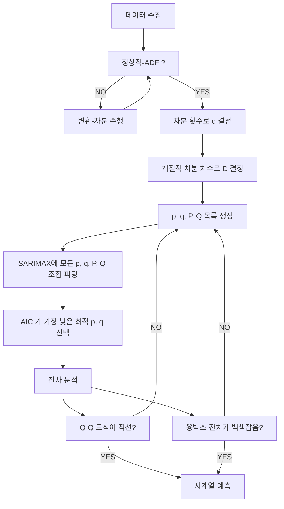

--- 
layout: single
classes: wide
title: "[Time] SARIMAX"
header:
  overlay_image: /img/data-science-bg.jpg
excerpt: '계절성과 비정상성을 처리하면서 외부 변수까지 활용할 수 있는 시계열 예측 통계적 모델 SARIMAX 에 대해 알아보자'
author: "window_for_sun"
header-style: text
categories :
  - AI/ML
tags:
    - Practice
    - Data Science
    - Time Series
    - AR
    - MA
    - ARMA
    - ARIMA
    - SARIMA
    - SARIMAX
toc: true
use_math: true
---  

## Seasonal ARIMAX (SARIMAX) Model
`SARIMAX`(Seasonal AutoRegressive Integrated Moving Average with eXogenous regressors) 모델은 
시계열 데이터의 예측에 사용되는 통계적 모델이다. 
이 모델은 계절성(`Seasonality`)과 비정상성(`Non-stationarity`)을 처리할 수 있으며, 외부 요인/변수(`Exogenous Variables`)이 
시계열에 미치는 영향을 함께 분석할 수 있도록 확장한 모델이다. 
`SARIMAX` 는 `SARIMA` 모델 구조에 외생 변수(`X`)를 추가하여, 계절적/비계절적 패턴뿐 아니라 기상, 경제 지표, 이벤트 등 
외부 변수의 영향까지 통합적으로 반영할 수 있다. 
보통 `SARIMAX(p,d,q)(P,D,Q)m + X` 형태로 표현하고, 
`(p,d,q)`는 비계절적 부분, `(P,D,Q)m`는 계절적 부분을 나타낸다. 
이는 `SARIMA` 와 동일하게 `AR`, `차분`, `MA`, `계절 AR`, `계절 차분`, `계절 MA`, `계절 주기` 를 의미하고, 
`X` 는 외생 변수의 수 또는 종류를 나타낸다. 


`MA`, `AR`, `ARMA`, `ARIMA`, `SARIMA`, `SARIMAX` 모델과의 차이점은 다음 표와 같다.

| 구분    | AR | MA | ARMA | ARIMA | SARIMA | SARIMAX |
|---------|----|----|------|-------|--------|---------|
| 모델 구조 | 과거 값 | 과거 오차 | 과거 값 + 오차 | 차분 후 과거 값, 오차 | 계절 차분 후 과거 값, 오차, 계절성 | SARIMA 구조 + 외생 변수(X) |
| 정상성 가정 | 정상 | 정상 | 정상 | 정상/비정상 | 정상/비정상/계절성 | 정상/비정상/계절성/외부요인 |
| 파라미터 | p | q | p, q | p, d, q | p, d, q, P, D, Q, s | p, d, q, P, D, Q, s, X |
| 적용 데이터 | 단순 정상 | 단순 정상 | 복합 정상 | 복합 정상/비정상 | 계절성·비계절성 시계열 | 계절성·비계절성·외부 요인 포함 시계열 |
| 예측력 | 보통 | 보통 | 높음 | 매우 높음 | 계절성 데이터에 최고 | 외부요인까지 반영, 예측력 최상 |
| 특징 | 자기상관 데이터 | 오차 자기상관 | 두 패턴 혼재 | 정상화 과정 포함 | 계절성·비정상성 모두 처리, 복잡한 패턴 | 외생 변수 포함, 실무 적용도 최고 |


### Identifying Exogenous Variables
외생 변수(`Exogenous Variables`)는 시계열 데이터에 영향을 미칠 수 있는
외부 요인 또는 변수를 의미한다. 
그러므로 `SARIMAX` 모델을 구축할 때는 시계열에 영향을 미칠 수 있는 외생 변수를 식별하는 것이 중요하다. 

`SARIMAX` 모델에서는 미국 거시경제 데이터를 사용한다. 
먼저 데이터를 불러오고 주요 필드를 확인하면 아래와 같다. 
테스트에 필요한 미국 거시경제 데이터는 `statsmodels` 패키지에서 제공하는 `macrodata` 데이터 세트를 사용한다.  

```python
import statsmodels.api as sm

macro_econ_data = sm.datasets.macrodata.load_pandas().data
macro_econ_data
#       year	quarter	    realgdp	    realcons	realinv	    realgovt	realdpi	    cpi 	    m1	        tbilrate	unemp	pop	        infl	realint
# 0	    1959.0	1.0	        2710.349	1707.4	    286.898	    470.045	    1886.9	    28.980	    139.7	    2.82	    5.8	    177.146	    0.00	0.00
# 1	    1959.0	2.0	        2778.801	1733.7	    310.859	    481.301	    1919.7	    29.150	    141.7	    3.08	    5.1	    177.830	    2.34	0.74
# 2	    1959.0	3.0	        2775.488	1751.8	    289.226	    491.260	    1916.4	    29.350	    140.5	    3.82	    5.3	    178.657	    2.74	1.09
# 3	    1959.0	4.0	        2785.204	1753.7	    299.356	    484.052	    1931.3	    29.370	    140.0	    4.33	    5.6	    179.386	    0.27	4.06
# 4	    1960.0	1.0	        2847.699	1770.5	    331.722	    462.199	    1955.5	    29.540	    139.6	    3.50	    5.2	    180.007	    2.31	1.19
# ...	...	...	...	...	    ...	...	...	...	...	    ...	...	...	...	...                 
# 198	2008.0	3.0	        13324.600	9267.7	    1990.693	991.551	    9838.3	    216.889	    1474.7	    1.17	    6.0	    305.270	    -3.16	4.33
# 199	2008.0	4.0	        13141.920	9195.3	    1857.661	1007.273	9920.4	    212.174	    1576.5	    0.12	    6.9	    305.952	    -8.79	8.91
# 200	2009.0	1.0	        12925.410	9209.2	    1558.494	996.287	    9926.4	    212.671	    1592.8	    0.22	    8.1	    306.547	    0.94	-0.71
# 201	2009.0	2.0	        12901.504	9189.0	    1456.678	1023.528	10077.5	    214.469	    1653.6	    0.18	    9.2	    307.226	    3.37	-3.19
# 202	2009.0	3.0	        12990.341	9256.0	    1486.398	1044.088	10040.6	    216.385	    1673.9	    0.12	    9.6	    308.013	    3.56	-3.44
# 203 rows × 14 columns
```  

각 변수에 대한 설명은 아래와 같다.  

| 변수       | 설명                                               |
|------------|--------------------------------------------------|
|realgdp    | 실질 국내총생산 (Real Gross Domestic Product), 목표/내생 변수 |
|realcons   | 실질 소비 (Real Consumption)                         |
|realinv    | 실질 투자 (Real Investment)                          |
|realgovt   | 실질 정부 지출 (Real Government Spending)              |
|realdpi    | 실질 가처분 소득 (Real Disposable Personal Income)      |
|cpi        | 소비자 물가 지수 (Consumer Price Index)                 |
|m1         | 통화 공급량 M1 (Money Supply M1)                      |
|tbilrate   | 단기 국채 금리 (3-Month Treasury Bill Rate)            |
|unemp      | 실업률 (Unemployment Rate)                          |
|pop        | 인구 (Population)                                  |
|infl       | 인플레이션율 (Inflation Rate)                          |
|realint    | 실질 이자율 (Real Interest Rate)                      |

테스트에서는 목표 변수 `realgdp`, `realcons`, `realinv`, `realgovt`, `realdpi`, `cpi` 5개 변수를 외생 변수를 사용해 총 6개 변수를 사용한다. 
모든 변수들이 시간에 따라 어떠한 패턴을 보이는지 시각화해보면 아래와 같다. 

```python
fig, axes = plt.subplots(nrows=3, ncols=2, dpi=300, figsize=(11,6))

for i, ax in enumerate(axes.flatten()[:6]):
    data = macro_econ_data[macro_econ_data.columns[i+2]]
    
    ax.plot(data, color='black', linewidth=1)
    ax.set_title(macro_econ_data.columns[i+2])
    ax.xaxis.set_ticks_position('none')
    ax.yaxis.set_ticks_position('none')
    ax.spines['top'].set_alpha(0)
    ax.tick_params(labelsize=6)

plt.setp(axes, xticks=np.arange(0, 208, 8), xticklabels=np.arange(1959, 2010, 2))
fig.autofmt_xdate()
plt.tight_layout()
```  


전체적으로 모든 변수들이 시간이 지남에 따라 상승하는 추세를 가지고 있다. 
목표 변수인 `realgdp` 와 비교했을 때 `realcons`, `realdpi`, `cpi` 변수는 유사한 패턴을 보이고,
`realinv`, `realgovt` 변수는 다소 다른 패턴을 보인다. 

시계열 예측에서 외생 변수를 선택하는 방법에는 2가지 방법이 있다. 
다양한 외생 변수 조합으로 여러 모델을 훈련하고 어떤 모델이 가장 좋은 예측을 보이는지 확인하는 것이다. 
또는 모든 외생 변수를 포함해 `AIC` 를 통해 모델을 선택하는 방법도 있다.  


### Precautions
`SARIMAX` 모델을 사용할 때 주의할 점이 있다. 
예측을 수행하는 시간단계에 대한 내용으로 
`SARIMAX` 모델은 `SARIMA(p,d,q)(P,D,Q)m` 모델에 외생 변수(`X`)의 선형 조합을 사용하여 미래의 한 시간 단계를 예측한다는 것을 기억해야 한다. 
만약 그 이상의 시간 단계를 예측이 필요하다면 `SARIMAX` 모델은 사용하는 외생 변수도 함께 예측해야 한다는 문제가 발생한다. 
이러한 문제로 인해 많은 시간 단계를 한번에 예측을 한다면 예측 시간 단계가 길어질 수록 목표 변수의 예측 오차가 계속해서 커지게 된다. 
결과적으로 외생 변수가 예측이 불필요하거나 정확한 예측이 가능하다면 문제가 없지만, 
외생 변수도 예측이 필요한 경우에 여러 시간 단계의 예측은 오차가 중첩되어 예측 정확도가 빠르게 저하된다는 점을 기억해야 한다.  


### Forecasting SARIMAX
`SARIMAX` 모델의 개념과 외생 변수 그리고 유의사항에 대해서 알아 보았기 때문에 이제 `GDP` 예측을 수행해 본다. 
`SARIMAX` 모델의 모델링 절차는 아래와 같이 `SARIMA` 모델링 절차와 동일하다.  



목표 변수와 외생 변수를 분리하고 목표 변수에 대해 정상성 검정을 위해 `ADF` 검정을 수행한다.  

```python
target = macro_econ_data['realgdp']
exog = macro_econ_data[['realcons', 'realinv', 'realgovt', 'realdpi', 'cpi']]

ad_fuller_result = adfuller(target)

print(f'ADF Statistic: {ad_fuller_result[0]}')
# ADF Statistic: 1.7504627967647166
print(f'p-value: {ad_fuller_result[1]}')
# p-value: 0.9982455372335032
```  

`ADF` 통계값이 큰 음수가 아니고, `p-value` 값이 0.05 보다 크므로 귀무가설을 기각할 수 없어 해당 목표 변수는 비정상 시계열임을 알 수 있다. 
차분을 수행하고 다시 `ADF` 검정을 수행하면 아래와 같다.  

```python
target_diff = target.diff()

ad_fuller_result = adfuller(target_diff[1:])

print(f'ADF Statistic: {ad_fuller_result[0]}')
# ADF Statistic: -6.305695561658104
print(f'p-value: {ad_fuller_result[1]}')
# p-value: 3.327882187668259e-08
```  

`ADF` 통계값이 음수이고, `p-value` 값이 0.05 보다 작으므로 귀무가설을 기각할 수 있어 해당 목표 변수는 정상 시계열임을 알 수 있다.
따라서 `d=1` 이고, 계절적 차분은 고려하지 않아도 되기 때문에 `D=0` 으로 설정한다.  

`SARIMAX` 모델에 모든 조합을 피팅하고 `AIC` 기준 오름차순으로 결과를 반환하는 `optimize_SARIMAX` 함수를 정의한다.  

```python
from typing import Union
from tqdm import tqdm_notebook
from statsmodels.tsa.statespace.sarimax import SARIMAX

def optimize_SARIMAX(endog: Union[pd.Series, list], exog: Union[pd.Series, list], order_list: list, d: int, D: int, s: int) -> pd.DataFrame:

    results = []

    for order in tqdm_notebook(order_list):
        try:
            model = SARIMAX(
                endog,
                exog,
                order=(order[0], d, order[1]),
                seasonal_order=(order[2], D, order[3], s),
                simple_differencing=False).fit(disp=False)
        except:
            continue

        aic = model.aic
        results.append([order, aic])

    result_df = pd.DataFrame(results)
    result_df.columns = ['(p,q,P,Q)', 'AIC']

    #Sort in ascending order, lower AIC is better
    result_df = result_df.sort_values(by='AIC', ascending=True).reset_index(drop=True)

    return result_df
```  

다음으로 `p`, `q`, `P`, `Q` 에 대해서 가능한 값의 범위를 정의해 모든 조합을 생성한다. 
계절적 요소인 `m(s)` 는 4분기이므로 `4` 로 설정한다.  

```python
p = range(0, 4, 1)
d = 1
q = range(0, 4, 1)
P = range(0, 4, 1)
D = 0
Q = range(0, 4, 1)
s = 4

parameters = product(p, q, P, Q)
parameters_list = list(parameters)
```  

모델 훈련 세트는 처음 200개 집합으로 사용한다. 
해당 훈련 세트로 `optimize_SARIMAX` 함수를 호출하여 `SARIMAX` 모델을 피팅하고 `AIC` 기준 오름차순으로 결과를 반환한다.  

```python
target_train = target[:200]
exog_train = exog[:200]

result_df = optimize_SARIMAX(target_train, exog_train, parameters_list, d, D, s)
result_df
#       (p,q,P,Q)	    AIC
# 0	    (3, 3, 0, 0)	1742.862713
# 1	    (3, 3, 1, 0)	1744.966704
# 2	    (3, 3, 0, 1)	1744.998032
# 3	    (2, 2, 0, 0)	1745.422233
# 4	    (2, 2, 0, 1)	1745.902126
# ...	...	...
# 251	(0, 2, 0, 0)	1761.579044
# 252	(0, 3, 0, 0)	1762.317095
# 253	(0, 0, 0, 0)	1764.754980
# 254	(1, 0, 0, 0)	1765.379412
# 255	(0, 1, 0, 0)	1765.813488
```  

`AIC` 기준 가장 낮은 `SARIMAX(3,1,3)(0,0,0)4` 모델을 선택하고 훈련 세트로 다시 피팅한다.  

```python
best_model = SARIMAX(target_train, exog_train, order=(3,1,3), seasonal_order=(0,0,0,4), simple_differencing=False)
best_model_fit = best_model.fit(disp=False)

print(best_model_fit.summary())
# SARIMAX Results
# ==============================================================================
# Dep. Variable:                realgdp   No. Observations:                  200
# Model:               SARIMAX(3, 1, 3)   Log Likelihood                -859.431
# Date:                Tue, 10 Aug 2021   AIC                           1742.863
# Time:                        19:03:39   BIC                           1782.382
# Sample:                             0   HQIC                          1758.857
# - 200
# Covariance Type:                  opg
# ==============================================================================
# coef    std err          z      P>|z|      [0.025      0.975]
# ------------------------------------------------------------------------------
# realcons       0.9652      0.044     21.693      0.000       0.878       1.052
# realinv        1.0142      0.033     30.944      0.000       0.950       1.078
# realgovt       0.7249      0.127      5.717      0.000       0.476       0.973
# realdpi        0.0091      0.025      0.369      0.712      -0.039       0.058
# cpi            5.8671      1.311      4.476      0.000       3.298       8.436
# ar.L1          1.0648      0.399      2.671      0.008       0.283       1.846
# ar.L2          0.4895      0.701      0.698      0.485      -0.885       1.864
# ar.L3         -0.6718      0.337     -1.995      0.046      -1.332      -0.012
# ma.L1         -1.1035      0.430     -2.565      0.010      -1.947      -0.260
# ma.L2         -0.3196      0.767     -0.417      0.677      -1.823       1.184
# ma.L3          0.6457      0.403      1.601      0.109      -0.145       1.436
# sigma2       328.9706     30.395     10.823      0.000     269.397     388.545
# ===================================================================================
# Ljung-Box (L1) (Q):                   0.00   Jarque-Bera (JB):                13.55
# Prob(Q):                              0.95   Prob(JB):                         0.00
# Heteroskedasticity (H):               3.57   Skew:                             0.32
# Prob(H) (two-sided):                  0.00   Kurtosis:                         4.11
# ===================================================================================
# 
# Warnings:
# [1] Covariance matrix calculated using the outer product of gradients (complex-step).
```  

피팅한 최종 모델의 요약을 보면 `realdip` 외생 변수의 `p-value` 값이 `0.0712` 로 다른 외생 변수의 `p-value` 값이 0인 것에 비해 상대적으로 크다. 
하지만 `p-value` 값이 `0.05` 보다 크다고 해서 반드시 해당 변수를 제거해야 하는 것은 아니므로 그대로 유지한다.  

이제 정성적 잔차 분석을 수행해 본다.  

```python
best_model_fit.plot_diagnostics(figsize=(10,8))
```  
