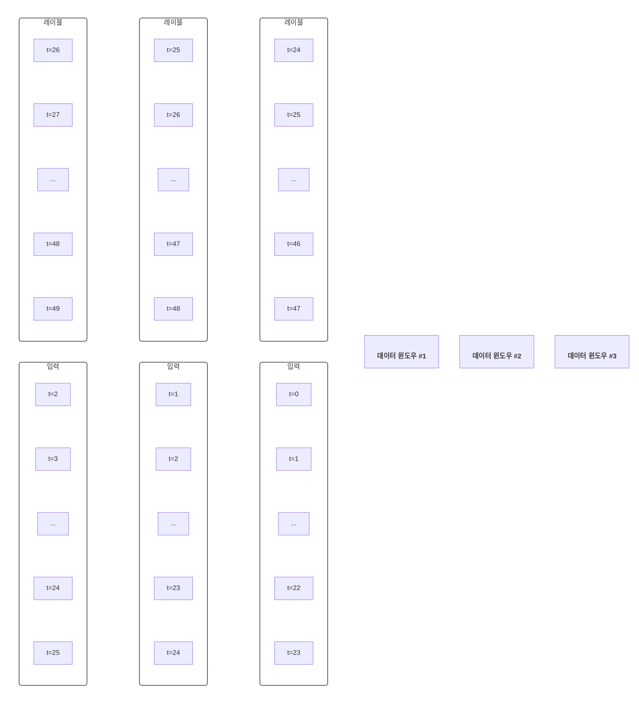

--- 
layout: single
classes: wide
title: "[LangChain] LangChain Ragas"
header:
  overlay_image: /img/langchain-bg-2.jpg
excerpt: 'LangChain 과 Ragas 를 사용해 Synthetic Test Dataset 을 생성하고 평가하는 방법에 대해 알아보자'
author: "window_for_sun"
header-style: text
categories :
  - LangChain
tags:
    - Practice
    - LangChain
    - AI
    - LLM
    - RAG
    - Ragas
    - Evaluation
    - Synthetic Test Dataset
    - Test Dataset
toc: true
use_math: true
---  

## Ragas
`Ragas` 는 `RAG` 시스템의 품질을 평하가고 검증하기 위한 오픈소스 라이브러리이다. 
`RAG` 파이프라인은 검색기와 생성기가 결합된 구조로, `Ragas` 는 이 파이프라인의 각 단계가 얼마나 잘 동작하는지를 체계적으로 측정하는 역할을 한다. 
`RAG` 파이프라인의 정확성, 일관성, 출처 신뢰성, 정보 회수력 등 여러 품질 지표를 자동으로 평가하고, 
수동 평가 없이도 다양한 메트릭을 제공한다. 
그리고 `LangChain`, `LlamaIndex` 등 다양한 프레임워크에서 손쉽게 연동할 수 있다. 

이번 포스팅에서는 `LangChain` 과 `Ragas` 를 사용해 테스트 데이터 셋을 생성하고 평가는 방법에 대해 알아본다.  

> 본 포스팅에서 사용한 `Ragas` 버전은 `0.2.15` 이다.


### Synthetic Test Dataset
`Synthetic Test Dataset` 은 실제 사용자 데이터가 부족하거나, 
특정 상황/도메인에 맞는 평가 데이터가 필요할 떄, 
`LLM` 등 자동화된 방법을 이용해 인위적으로 생성한 평가용 데이터셋을 의미한다. 
보통 `RAG` 시스템의 질적 평가를 위해서는 `query`, `context`, `answer` 이 세트로 구성된 데이터셋이 필요한데, 
이걸 사람이 직접 만드는 것은 시간과 비용이 많이 든다. 
`Ragas` 는 이런 데이터셋을 자동으로 생성하는 기능을 제공한다.  

먼저 `RAG` 에 사용할 문서를 로드하고 일부분만 사용한다.  

```python
from langchain_community.document_loaders import PyPDFLoader

pdf_loader = PyPDFLoader("./SPRi AI Brief 5월호 산업동향.pdf")
pdf_docs = pdf_loader.load()

pdf_docs_mini = pdf_docs[10:17]

for doc in pdf_docs_mini:
  doc.metadata['filename'] = doc.metadata['source']

print(len(pdf_docs_mini))
# 7

splitter = RecursiveCharacterTextSplitter(chunk_size=1000, chunk_overlap=200)

split_docs = splitter.split_documents(pdf_docs_mini)
print(len(split_docs))
# 17
```  

테스트셋 생성에 사용할 `LLM` 모델과 `Embedding` 모델을 초기화한다.  

```python
from langchain_google_genai import ChatGoogleGenerativeAI
from ragas.llms import LangchainLLMWrapper
from ragas.embeddings import LangchainEmbeddingsWrapper
from langchain_huggingface.embeddings import HuggingFaceEndpointEmbeddings
from langchain_huggingface.embeddings import HuggingFaceEmbeddings
import os

os.environ["GOOGLE_API_KEY"] = "api key"
generator_llm = LangchainLLMWrapper(ChatGoogleGenerativeAI(model="gemini-2.0-flash"))

os.environ["HUGGINGFACEHUB_API_TOKEN"] = "api key"
model_name = "BM-K/KoSimCSE-roberta"
hf_endpoint_embeddings = HuggingFaceEndpointEmbeddings(
    model=model_name,
    huggingfacehub_api_token=os.environ["HUGGINGFACEHUB_API_TOKEN"],
)
hf_embeddings = HuggingFaceEmbeddings(
    model_name=model_name,
    encode_kwargs={'normalize_embeddings':True},
)
generator_embeddings = LangchainEmbeddingsWrapper(hf_embeddings)
```  

불러온 문서를 `Knowledge Graph` 를 생성해 추가한다.  

```python
from ragas.testset.graph import KnowledgeGraph
from ragas.testset.graph import Node, NodeType

kg = KnowledgeGraph()

for doc in split_docs:
  kg.nodes.append(
      Node(
          type=NodeType.DOCUMENT,
          properties={
              "page_content" : doc.page_content,
              "document_metadata" : doc.metadata
          }
      )
  )

print(kg)
# KnowledgeGraph(nodes: 17, relationships: 0)


```  

노드로만 구성한 지식 그래프를 사용해 `SingleHop` 데이터셋 생성을 위해 그래프를 개선하고 쿼리 생성을 개선하기 위해 `KeyphrasesExtractor` 를 사용한다. 
필요한 경우 `Ragas` 에서 제공하는 다양한 변환을 적용할 수 있다. 
`KeyphrasesExtractor` 를 사용하면 생성된 쿼리의 다양성과 관련성을 풍부하게 하는 의미론적 시드 포인트 역할을 하는 핵심 주제 키구문을 식별할 수 있다.  

```python
from ragas.testset.transforms import apply_transforms
from ragas.testset.transforms import KeyphrasesExtractor

keyphrase_extractor = KeyphrasesExtractor(llm=generator_llm)

transforms = [
    keyphrase_extractor
]

apply_transforms(kg, transforms=transforms)
```  

그리고 쿼리 생성을 위한 `Persona` 를 구성한다. 
페르소나는 생성된 쿼리가 자연스럽고 사용자에 따라 다르며 다양한 맥락과 관점을 제공한다. 
쿼리를 다양한 사요앚 관점에 맞게 조정함으로써, 테스트 세트는 다양한 시나리오와 사용자 요구를 포괄할 수 있다. 
현재 예제 문서는 기업관련 `AI` 최신 기술 소개를 다루기 때문에 각 직무에 따른 시나리오를 다룬다.  

```python
from ragas.testset.persona import Persona

persona_general_public = Persona(
    name="general public",
    role_description="A person with little to no background in technology or artificial intelligence. They are interested in understanding how AI impacts their daily life and society, focusing on clear, jargon-free explanations and practical implications."
)

persona_software_developer = Persona(
    name="software developer",
    role_description="A professional with experience in programming and software engineering, but not necessarily specialized in AI. They are interested in how AI technologies work under the hood, potential integration points, and best practices for implementation."
)

persona_ai_expert = Persona(
    name="ai expert",
    role_description="An individual with a deep understanding of artificial intelligence, including theory, algorithms, and practical applications. They seek detailed technical information, research references, and advanced discussions on model architectures and performance."
)

personas = [persona_general_public, persona_software_developer, persona_ai_expert]
```  

`Synthesizer` 는 풍부한 노드와 페르소나를 쿼리로 변환하는 역할을 한다. 
`keyphrase` 와 같은 노드 속성을 선택하고, 
이를 페르소나, 스타일, 쿼리 길이와 페어링해 `LLM` 을 사용해서 노드의 내용을 기반으로 쿼리-응답 쌍을 생성한다.  
현재 예제는 `Keyphrases-Based Synthesizer` 를 사용해 주요 개념에 대한 쿼리를 형성하여 더 광범위하고 주제별 질문을 생성하도록 했다.  
필요한 경우 다양한 `Synthesizer` 를 함께 사용하고, 각 `Synthesizer` 의 가중치를 조정하여 쿼리 분포를 제어할 수 있다.  

```python
from ragas.testset.synthesizers.single_hop.specific import (
    SingleHopSpecificQuerySynthesizer
)

query_distribution = [
    (
        SingleHopSpecificQuerySynthesizer(llm=generator_llm, property_name="keyphrase"),
        1
    )
]
```  

이제 모든 준비가 완료됐기 때문에 `TestGenerator` 생성하고 10개의 테스트 세트를 생성한다.  

```python
from ragas.testset import TestsetGenerator

generator = TestsetGenerator(
    llm=generator_llm,
    embedding_model=generator_embeddings,
    knowledge_graph=kg,
    persona_list=personas
)

testset = generator.generate(testset_size=10, query_distribution=query_distribution)
testset_df = testset.to_pandas()
testset_df.to_csv("ragas_synthetic_dataset.csv")
```  

생성한 테스트 세트 결과를 일부만 출력하면 아래와 같다. 

user_input| reference_contexts                                                                                                                                                                                                                                                                                                                                                                                                                                                                                                                                                                                                                                                                                                                                                                                                                                                                                                                                                                                                                                                                                                                                                                                                                                                                                                                                                                                                                                                                                                                                                                                                                          |reference|synthesizer_name
---|---------------------------------------------------------------------------------------------------------------------------------------------------------------------------------------------------------------------------------------------------------------------------------------------------------------------------------------------------------------------------------------------------------------------------------------------------------------------------------------------------------------------------------------------------------------------------------------------------------------------------------------------------------------------------------------------------------------------------------------------------------------------------------------------------------------------------------------------------------------------------------------------------------------------------------------------------------------------------------------------------------------------------------------------------------------------------------------------------------------------------------------------------------------------------------------------------------------------------------------------------------------------------------------------------------------------------------------------------------------------------------------------------------------------------------------------------------------------------------------------------------------------------------------------------------------------------------------------------------------------------------------------|---|---
Wut iz A2A?| ['정책･법제기업･산업기술･연구인력･교육\n9\n구글, AI 에이전트 간 통신 프로토콜 ‘A2A’ 공개 및 MCP 지원 발표n구글이 에이전트 간 상호운용성을 보장하기 위한 개방형 통신 프로토콜 A2A를 공개했으며, A2A는 에이전트 간 기능 탐색, 작업 관리, 협업, 사용자 경험 협의 등의 다양한 기능을 지원n구글은 제미나이 모델과 SDK에서 앤스로픽의 MCP 지원을 추가하기로 했으며, A2A가 MCP보다 상위 계층의 프로토콜로서 MCP를 보완한다고 설명\nKEY Contents']|구글이 에이전트 간 상호운용성을 보장하기 위한 개방형 통신 프로토콜 A2A를 공개했으며, A2A는 에이전트 간 기능 탐색, 작업 관리, 협업, 사용자 경험 협의 등의 다양한 기능을 지원|single_hop_specifc_query_synthesizer                                                                                                                                                                                                                                                                                                                                                                                                                                                                                                                                                                                                                                                                                                                                                                                                                                                                                                                                                                                                                                                                                                                                                                                                               
What is A2A protocol and what it do?| ['£A2A, 다중 에이전트 간 협업을 위한 개방형 프로토콜로 설계n구글(Google)이 2025년 4월 9일 50개 이상의 기업*과 협력해 AI 에이전트 간 통신을 위한 개방형 프로토콜 ‘A2A(Agent2Agent)’를 공개* 액센추어(Accenture), 코히어(Cohere), 랭체인(Langchain), 페이팔(Paypal), 세일즈포스(Salesforce) 등∙구글은 다양한 플랫폼과 클라우드 환경에서 다중 AI 에이전트가 서로 통신하고 안전하게 정보를 교환하며 작업을 조정할 수 있도록 A2A 프로토콜을 출시했다고 발표∙구글에 따르면 A2A는 AI 에이전트 간 협업을 위한 표준 방식을 제공하기 위해 HTTP, SSE, JSON-RPC 등 기존 표준을 기반으로 구축되었으며, 기업 환경에서 요구하는 높은 수준의 인증 및 권한 관리 기능을 제공하고 빠른 작업뿐 아니라 장시간 작업 환경에도 적합하며, 텍스트와 오디오, 동영상 스트리밍도 지원nA2A는 작업을 구성하고 전달하는 역할을 하는 클라이언트 에이전트(Client Agent)와 작업을 수행하는 원격 에이전트(Remote Agent) 간 원활한 통신을 위해 다음과 같은 기능을 제공∙(기능 탐색) 각 에이전트가 자신의 기능을 JSON* 형식의 ‘에이전트 카드**’를 통해 공개하면 클라이언트 에이전트는 작업 수행에 가장 적합한 에이전트를 식별해 A2A로 원격 에이전트와 통신* 키-값 쌍으로 이루어진 데이터 객체를 표현하기 위한 텍스트 기반의 개방형 표준 형식** 에이전트의 기능과 스킬, 인증 요구사항 등을 설명하는 공개 메타데이터 파일∙(작업 관리) 클라이언트 에이전트와 원격 에이전트는 최종 사용자의 요청에 대응해 작업 수명주기 전반에서 작업 처리 상태를 지속 동기화하여 처리∙(협업) 각 에이전트는 서로 컨텍스트, 응답, 작업 결과물, 사용자 지시와 같은 메시지를 교환해 협업을 진행∙(사용자 경험 협의) 각 메시지에는 이미지, 동영상, 웹 양식과 같은 특정 콘텐츠 유형이 명시되어 있어, 각 에이전트는 사용자']|A2A is a open protocol for collaboration between multiple agents. Google released it on April 9, 2025, in collaboration with over 50 companies. It enables multiple AI agents to communicate, securely exchange information, and coordinate tasks across various platforms and cloud environments. A2A provides a standard way for AI agents to collaborate, built on existing standards like HTTP, SSE, and JSON-RPC. It offers authentication and authorization features, supports both short and long tasks, and handles text, audio, and video streaming.|single_hop_specifc_query_synthesizer 
can yuo explayn what agennts do in a simple way?| ['에이전트와 원격 에이전트는 최종 사용자의 요청에 대응해 작업 수명주기 전반에서 작업 처리 상태를 지속 동기화하여 처리∙(협업) 각 에이전트는 서로 컨텍스트, 응답, 작업 결과물, 사용자 지시와 같은 메시지를 교환해 협업을 진행∙(사용자 경험 협의) 각 메시지에는 이미지, 동영상, 웹 양식과 같은 특정 콘텐츠 유형이 명시되어 있어, 각 에이전트는 사용자 인터페이스(UI)에 맞게 적절한 콘텐츠 형식을 협의£구글, 제미나이 모델과 SDK에서 앤스로픽의 MCP 지원 발표n한편, 구글 딥마인드(Google Deepmind)의 데미스 하사비스(Demis Hassabis) CEO는 2025년 4월 9일 X를 통해 구글이 앤스로픽의 MCP를 제미나이 모델과 SDK에서 지원하겠다고 발표** https://x.com/demishassabis/status/1910107859041271977∙구글에 따르면 A2A는 MCP를 보완하는 역할로서, MCP가 LLM을 데이터, 리소스 및 도구와 연결하는 프로토콜이라면 A2A는 에이전트 간 협업을 위한 상위 수준의 프로토콜에 해당 출처 Google, Announcing the Agent2Agent Protocol (A2A), 2025.04.09.']|Agents and remote agents handle user requests by continuously synchronizing the status of tasks throughout their lifecycle. They collaborate by exchanging messages containing context, responses, work results, and user instructions. These messages specify content types like images, videos, and web forms, allowing agents to agree on appropriate formats for the user interface.|single_hop_specifc_query_synthesizer
What are the key contents of the SPRi AI Brief May 2025?|['SPRi AI Brief2025년 5월호\n10\n메타, 멀티모달 AI 모델 ‘라마 4’ 제품군 공개 및 성능 조작 의혹 부인n메타가 라마 시리즈 최초로 전문가혼합 모델로 설계되고 멀티모달 기능을 기본 탑재한 라마 4 제품군 중 스카우트와 라마를 출시하고 베히모스는 프리뷰로 공개n라마 4 공개 이후 메타가 성능 평가에 사용한 버전과 실제 개발자에게 제공되는 버전 간 성능 차이로 인해 메타가 테스트셋으로 모델을 학습시켰다는 의혹이 제기되었으나 메타는 이를 부인\nKEY Contents']|The SPRi AI Brief May 2025 discusses Meta releasing the Llama 4 product line, which includes Scout and Llama, with Behimos available as a preview. It also mentions allegations that Meta manipulated performance by training the model with the test set, which Meta denies.|single_hop_specifc_query_synthesizer


### Evaluation by Ragas
저장한 테스트 세트를 로드하고 `Ragas` 를 사용해 평가에 필요한 전처리를 수행한다.  

```python
from datasets import Dataset
import pandas as pd
import ast

df = pd.read_csv("./ragas_synthetic_dataset.csv")

test_dataset = Dataset.from_pandas(df)
# Dataset({
#     features: ['Unnamed: 0', 'user_input', 'reference_contexts', 'reference', 'synthesizer_name'],
#     num_rows: 10
# })

def convert_to_list(example):
    contexts = ast.literal_eval(example['reference_contexts'])
    return {"contexts": contexts}


test_dataset = test_dataset.map(convert_to_list)
# Dataset({
#     features: ['Unnamed: 0', 'user_input', 'reference_contexts', 'reference', 'synthesizer_name', 'contexts'],
#     num_rows: 10
# })
```  

그리고 답변 생성을 위해 동일한 문서를 기반으로 `RAG` 파이프라인을 구성한다. 

```python
from langchain_text_splitters import RecursiveCharacterTextSplitter
from langchain_community.document_loaders import PyMuPDFLoader
from langchain_community.vectorstores import Chroma
from langchain_core.output_parsers import StrOutputParser
from langchain_core.runnables import RunnablePassthrough
from langchain_core.prompts import PromptTemplate

pdf_loader = PyPDFLoader("./SPRi AI Brief 5월호 산업동향.pdf")
pdf_docs = pdf_loader.load()

pdf_docs_mini = pdf_docs[10:17]
print(len(pdf_docs_mini))

for doc in pdf_docs_mini:
  doc.metadata['filename'] = doc.metadata['source']
pdf_docs_mini[0]


text_splitter = RecursiveCharacterTextSplitter(chunk_size=1000, chunk_overlap=100)
split_documents = text_splitter.split_documents(pdf_docs_mini)

vectorstore = Chroma.from_documents(split_documents, hf_embeddings)

retriever = vectorstore.as_retriever()

prompt = PromptTemplate.from_template(
    """You are an assistant for question-answering tasks. 
Use the following pieces of retrieved context to answer the question. 
If you don't know the answer, just say that you don't know. 
Final answer must be in Korean.

#Context: 
{context}

#Question:
{question}

#Answer:"""
)

llm = ChatGoogleGenerativeAI(model="gemini-2.0-flash")

chain = (
        {"context" : retriever, "question" : RunnablePassthrough()}
        | prompt
        | llm
        | StrOutputParser()
)
```  

`RAG` 파이프라인에서 사용할 사용자 질문은 테스트 세트에 있는 `user_input` 컬럼을 사용한다.  

```python
batch_dataset = [question for question in test_dataset["user_input"]]
# ['Wut iz A2A?',
#  'What is A2A protocol and what it do?',
#  'can yuo explayn what agennts do in a simple way?',
#  'What are the key contents of the SPRi AI Brief May 2025?',
#  'What is, like, the dealio with 라마 4, and how many parameters do 라마 4 스카우트 and 라마 4 매버릭 got, and also, like, what kinda performance do they do on them benchmarky things, and also, like, what is 라마 4 베히모스 doing?',
#  "Can you eloborate on the controversy surrounding Meta's Llama 4 model and the allegations of benchmark manipulation, including details about the performance differences and Meta's response to these claims, and also provide information about the Llama 4 Behemoth model's architecture and performance in comparison to other models like Claude Sonnet 3.7 and Gemini 2.0 Pro?",
#  'Wut iz Amazon Nova Act?',
#  'What is Amazon Nova Act?',
#  'Wat r sum AI releeses?',
#  'GPT-4.1 good?']
```  

배치를 사용해 위 질의에 대한 답변을 생성한다.  

```python
answers = chain.batch(batch_dataset)

print(answers[:3])
# ['A2A는 에이전트 간 상호 운용성을 보장하기 위한 개방형 통신 프로토콜입니다. 에이전트 간 기능 탐색, 작업 관리, 협업, 사용자 경험 협의 등의 다양한 기능을 지원합니다. 또한, A2A는 MCP보다 상위 계층의 프로토콜로서 MCP를 보완합니다.',
#  'A2A는 구글이 공개한 AI 에이전트 간의 상호 운용성을 보장하기 위한 개방형 통신 프로토콜입니다. A2A는 에이전트 간 기능 탐색, 작업 관리, 협업, 사용자 경험 협의 등의 다양한 기능을 지원합니다. 다양한 플랫폼과 클라우드 환경에서 다중 AI 에이전트가 서로 통신하고 안전하게 정보를 교환하며 작업을 조정할 수 있도록 합니다.',
#  '문맥에서 AI 에이전트가 무엇을 하는지 간단하게 설명하자면, 사용자가 매번 진행 과정을 확인하지 않아도 AI 에이전트가 직접 작업을 수행할 수 있도록 도와줍니다. 예를 들어, 매주 같은 시간에 샐러드를 자동으로 주문하는 등 반복 작업을 자동 실행하도록 설정할 수 있습니다. 또한, API가 제공되지 않는 서비스에서 직접 인터넷을 탐색하고 사용자 대신 작업을 완료할 수도 있습니다.']
```  

이제 도출된 답변의 결과를 테스트 세트의 `answer` 컬럼으로 추가한다.  

```python

if "answer" in test_dataset.column_names:
  test_dataset = test_dataset.remove_columns(["answer"]).add_column("answer", answers)
else:
  test_dataset = test_dataset.add_column("answer", answers)


print(test_dataset[0])
# {'Unnamed: 0': 0,
#  'user_input': 'Wut iz A2A?',
#  'reference_contexts': "['정책･법제기업･산업기술･연구인력･교육\\n9\\n구글, AI 에이전트 간 통신 프로토콜 ‘A2A’ 공개 및 MCP 지원 발표n구글이 에이전트 간 상호운용성을 보장하기 위한 개방형 통신 프로토콜 A2A를 공개했으며, A2A는 에이전트 간 기능 탐색, 작업 관리, 협업, 사용자 경험 협의 등의 다양한 기능을 지원n구글은 제미나이 모델과 SDK에서 앤스로픽의 MCP 지원을 추가하기로 했으며, A2A가 MCP보다 상위 계층의 프로토콜로서 MCP를 보완한다고 설명\\nKEY Contents']",
#  'reference': '구글이 에이전트 간 상호운용성을 보장하기 위한 개방형 통신 프로토콜 A2A를 공개했으며, A2A는 에이전트 간 기능 탐색, 작업 관리, 협업, 사용자 경험 협의 등의 다양한 기능을 지원',
#  'synthesizer_name': 'single_hop_specifc_query_synthesizer',
#  'contexts': ['정책･법제기업･산업기술･연구인력･교육\n9\n구글, AI 에이전트 간 통신 프로토콜 ‘A2A’ 공개 및 MCP 지원 발표n구글이 에이전트 간 상호운용성을 보장하기 위한 개방형 통신 프로토콜 A2A를 공개했으며, A2A는 에이전트 간 기능 탐색, 작업 관리, 협업, 사용자 경험 협의 등의 다양한 기능을 지원n구글은 제미나이 모델과 SDK에서 앤스로픽의 MCP 지원을 추가하기로 했으며, A2A가 MCP보다 상위 계층의 프로토콜로서 MCP를 보완한다고 설명\nKEY Contents'],
#  'answer': 'A2A는 에이전트 간 상호 운용성을 보장하기 위한 개방형 통신 프로토콜입니다. 에이전트 간 기능 탐색, 작업 관리, 협업, 사용자 경험 협의 등의 다양한 기능을 지원합니다. 또한, A2A는 MCP보다 상위 계층의 프로토콜로서 MCP를 보완합니다.'}
```  

테스트 세트를 바탕으로 각 테스트 셋에 대한 `SingleTurnSample` 을 생성하고, 
생성된 `SingleTurnSample` 을 바탕으로 평가에 사용할 `EvaluationDataset` 을 생성한다.  

```python
from ragas import EvaluationDataset
from ragas.dataset_schema import SingleTurnSample

test_dataset_list = test_dataset.map(convert_to_list)


evaluation_sample_list = [SingleTurnSample(
    user_input=dataset["user_input"],
    retrieved_contexts=dataset["contexts"],
    response=dataset["answer"],
    reference=dataset["reference"]
) for dataset in test_dataset_list]


evaluation_dataset_ragas = EvaluationDataset(samples=evaluation_sample_list)
```  

`Ragas` 에는 다양한 평가 메트릭을 제공하는데 그 상세한 내용은 [여기](https://docs.ragas.io/en/stable/concepts/metrics/overview/)
에서 확인할 수 있다. 
예제에서는 `ContextPrecision`, `ContextRecall`, `ResponseRelevancy`, `Faithfulness` 지표를 사용해 평가를 진행한다. 
1개 이상의 퍙가 메트릭을 한번에 평가할 수 있지만, 요쳥량 제한 이슈로 각 하나씩 진행한다.  

```python
from ragas.dataset_schema import SingleTurnSample
from ragas import evaluate
from ragas.metrics import (
    ResponseRelevancy,
    Faithfulness,
    LLMContextRecall,
    LLMContextPrecisionWithReference
)

context_precision = LLMContextPrecisionWithReference(llm=generator_llm)
context_recall = LLMContextRecall(llm=generator_llm)
response_relevancy = ResponseRelevancy(llm=generator_llm, embeddings=generator_embeddings)
faithfulness = Faithfulness(llm=generator_llm)


context_precision_result = evaluate(
    dataset=evaluation_dataset_ragas,
    metrics=[
        context_precision,
    ]
)
# {'llm_context_precision_with_reference': 1.0000}

context_recall_result = evaluate(
    dataset=evaluation_dataset_ragas,
    metrics=[
        context_recall,
    ]
)
# {'context_recall': 1.0000}

response_relevancy_result = evaluate(
    dataset=evaluation_dataset_ragas,
    metrics=[
        response_relevancy,
    ]
)
# {'answer_relevancy': 0.5216}

faithfulness_result = evaluate(
    dataset=evaluation_dataset_ragas,
    metrics=[
        faithfulness,
    ]
)
# {'faithfulness': 0.7971}
```  

위 결과는 전체 테스트 세트에 대한 평균치이고, 각 테스트 세트에 대한 점수가 궁금하다면 `to_pandas()` 를 사용해 개별적으로 확인해 볼 수도 있다.  




---  
## Reference
[Ragas Testset Generation](https://docs.ragas.io/en/stable/howtos/applications/singlehop_testset_gen/)  
[Ragas Evaluation](https://docs.ragas.io/en/stable/concepts/components/eval_sample/)  
[Ragas Metrics](https://docs.ragas.io/en/stable/concepts/metrics/overview/)  
[Ragas 평가](https://wikidocs.net/259205)


